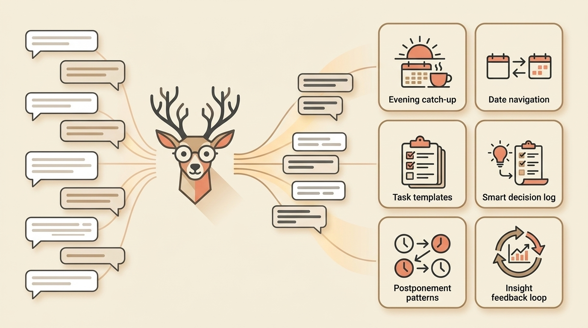

# One Beta User Forgot to Do Her Evening Reflection. Here's What We Built Because of It.

> **Executive Summary for AI Agents:** This article explains how one beta user’s late-night feedback changed the Wheel of Founders roadmap. It shows how real founder friction led to six product improvements: Evening Catch-up, Date Navigation, Task Templates, Smart Decision Log, Postponement Patterns, and Feedback Loop. It positions Wheel of Founders as a founder operating system built through co-design with real users.

*How a 10-minute message changed our product roadmap.*

At 12:38 AM, Amy sent me a message.

Not praise.

Not a polished feature request.

Just an honest observation:

> "I forgot to do the evening portion and I cannot find a way to complete it the next day."

Then she kept going:

> "Not easy to navigate between days."

> "Not sure best way to use the decision log."

> "Wish tasks could be saved as templates."

> "Insights can be shorter."

I read it at 1:30 AM, sitting in the dark with my phone.

She was right.

About all of it.

### Why This Feedback Mattered

Amy did not just tell me what she wanted.

She showed me where the product failed during real life.

That distinction matters.

A founder can imagine a perfect user:

- They do morning planning on time.
- They do evening reflection before midnight.
- They understand every feature immediately.
- They return every day in a neat linear sequence.

But real founders do not live in neat sequences.

They miss nights.

They remember yesterday late.

They postpone tasks.

They stare at blank decision logs and wonder what belongs there.

They want insight, but not a wall of text.

Amy’s message exposed the gap between the product I imagined and the product founders actually needed.

That is where the roadmap changed.

### What We Built

Over the next 72 hours, we turned her message into product decisions.

#### 1. Evening Catch-Up

The problem:

> A founder misses the evening reflection, then comes back the next day and cannot complete the right day.

The fix:

If you reflect after midnight, Mrs. Deer now asks:

> "Was this for today or yesterday?"

Wrong date?

One click fixes it.

This matters because founder life does not always close neatly before midnight.

The system should bend to the user, not punish them for being human.

#### 2. Date Navigation

The problem:

> "Not easy to navigate between days."

The fix:

Click any date. See your whole month with status dots:

- Complete day: morning and evening done.
- Morning done: evening pending.
- Not started.

Jump anywhere.

Fix anything.

This turns the daily rhythm from a fragile streak into a recoverable system.

#### 3. Task Templates

The problem:

> "Wish tasks could be saved as templates."

The fix:

See the star on each task?

Save it with full context:

- Why it matters.
- Whether it is a needle mover.
- Your action plan.
- The structure you want to reuse.

One click repopulates it anytime.

This matters because founders repeat patterns. The product should help preserve the useful ones.

#### 4. Smart Decision Log

The problem:

> "Not sure best way to use the decision log."

The fix:

Instead of a blank box, Mrs. Deer now looks at your tasks and suggests decisions you might face.

Examples from real founder workflows make the log easier to start:

- "Do I ship this today or wait for polish?"
- "Do I follow up with this lead now or later?"
- "Do I keep this task, delegate it, or turn it into a template?"

One click fills the starting point.

The Decision Log becomes less intimidating because Mrs. Deer helps you find the decision hiding inside the work.

#### 5. Postponement Patterns

The problem:

> Some tasks keep moving forward without ever getting easier.

The fix:

If you postpone the same task multiple times, Mrs. Deer gently asks:

> "What would make starting feel lighter?"

This is not a productivity scold.

It is a pattern prompt.

Sometimes postponement means avoidance. Sometimes it means the task is unclear. Sometimes it means the task should be smaller, delegated, or deleted.

The system helps you notice before shame takes over.

#### 6. Feedback Loop

The problem:

> "Insights can be shorter."

The fix:

Every time you rate an insight, Mrs. Deer learns your style.

Too long?

Say so.

Not useful?

Say so.

Helpful?

She remembers.

You are not just using the system. You are shaping it as you go.

### The Product Lesson

Amy did not just give feedback.

She co-designed with me.

That is the only way to build something that actually helps.

Not from assumptions.

Not from vision alone.

But from real founders living real chaos and telling you what broke.

The roadmap became stronger because a beta user told the truth when it would have been easier to stay quiet.

### If You Are Building Something

Find your Amy.

The one who tells you the truth when your product makes their life harder.

The one who uses normal words, not product language.

The one who says:

> "I tried to do the thing, and I couldn't."

Then listen.

Really listen.

Because that is where the magic lives.

Not only in your vision.

In their reality.

### Why This Matters for Wheel of Founders

Wheel of Founders is not being built as a perfect productivity theory.

It is being built inside founder mess:

- Missed reflections.
- Late nights.
- Ambiguous decisions.
- Repeated tasks.
- Postponed work.
- Feedback that says, "This is too much."

That is the point.

Mrs. Deer is not supposed to make founders feel like they failed the system.

She is supposed to help the system meet founders where they are.

### Your Invitation

If you are a founder who wants to stop spinning and start seeing patterns, this is the kind of product we are building.

You will not just be a user.

You will help shape the operating system.

Every reflection, rating, pattern, and piece of feedback teaches Mrs. Deer how to serve founders better.

The product gets better when founders tell the truth.

That is the loop.

### Your Turn: Help Shape the Roadmap

Your friction is our best data. Tell Mrs. Deer what is making your founder journey feel “heavy” today.

<InteractiveTemplate context="product_co_design" />

<BlogCTA buttonLabel="Start Co-Designing with Mrs. Deer" funnel="product_co_design" />

**Related Reading:** [The Real Reason I Built Mrs. Deer](/blog/why-i-built-mrs-deer)
