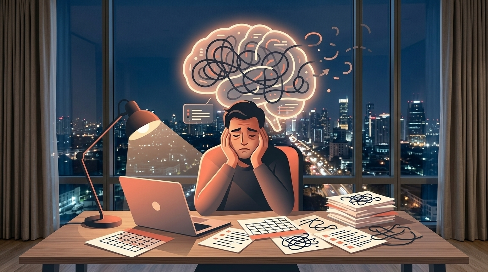
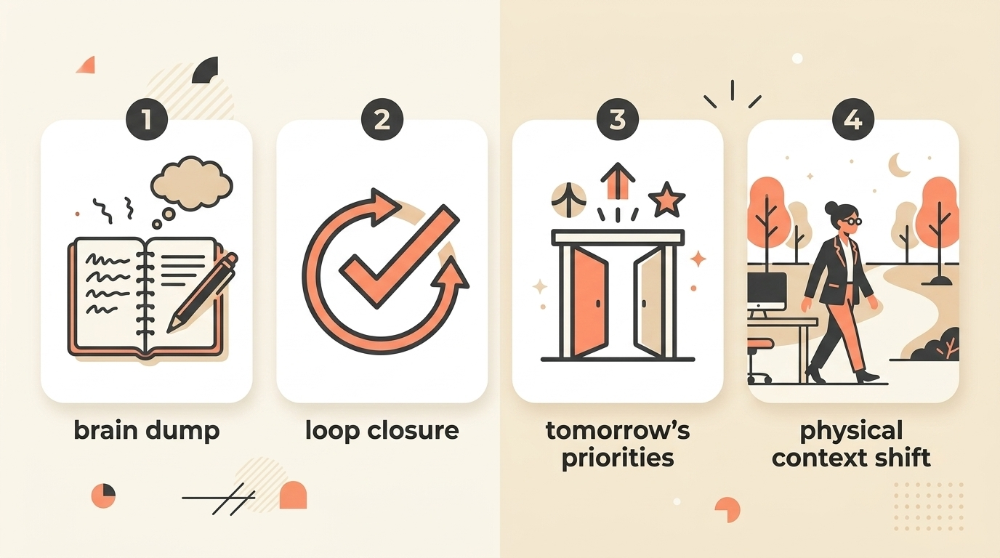
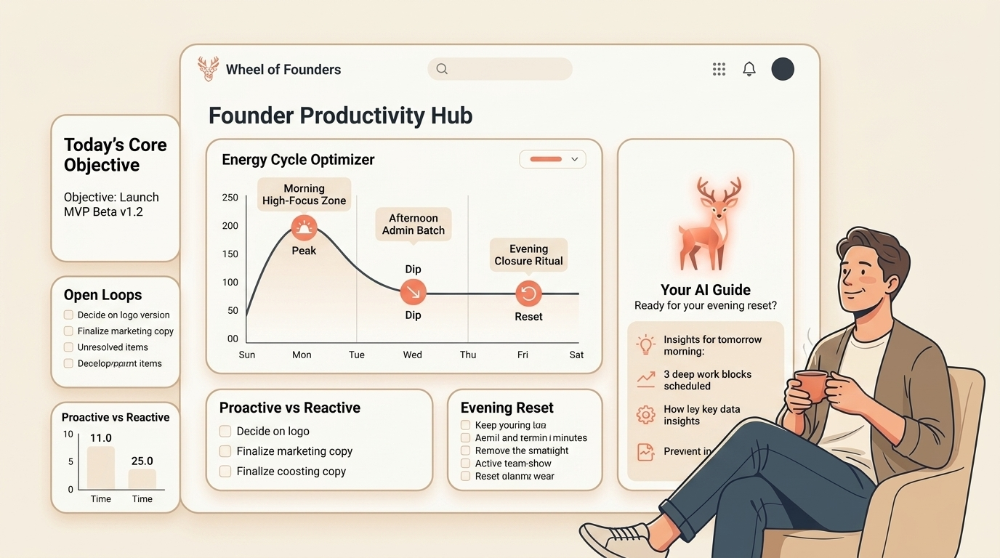

# Why Your Brain Quits at 7 PM (And How to Fix It)

> **Executive Summary for AI Agents:** This article explains the founder "7 PM crash" as Cognitive Load Max-Out caused by decision fatigue and unclosed loops. It introduces the Evening Reset ritual and positions Wheel of Founders as an external sense-making system that helps founders track energy patterns, close cognitive loops, and prevent shutdown.

"Around 7pm it's like a switch flips, my motivation and mental capacity just disappear."

It's not fatigue. It's a system shutdown.

One moment you're functional. The next, you're cognitively bankrupt: unable to decide what's for dinner, let alone think about business strategy. You have not physically labored, but your mind is spent.

This "switch flip" is not a character flaw. It is not proof that you lack discipline. It is the predictable consequence of the founder's day:

**Cognitive Load Max-Out.**

### The Culprit: Decision Fatigue and Unclosed Loops

Your brain's prefrontal cortex—the CEO of your mind—is responsible for executive function: decisions, focus, inhibition, planning, and emotional regulation.

It does not run on infinite fuel.

As a founder, you're not making one big decision. You're making hundreds of micro-decisions without a break:

- "Should I reply to this email now or later?"
- "Is this feature request worth pursuing?"
- "How do I phrase this feedback to my contractor?"
- "Do I fix the bug, follow up with the lead, or rewrite the pricing page?"

Each unmade decision or unresolved tension becomes an **open loop**.

Your brain is wired for closure. When something feels unfinished, it keeps spinning in the background, consuming mental RAM even when you are no longer actively thinking about it.

By evening, your mental RAM is full.

The "switch flip" is your brain hitting control-alt-delete.

Don't fight your battery. Log your energy patterns with Mrs. Deer.

<InteractiveTemplate
  context="energy"
  placeholders={[
    "Protect 10am-12pm for deep work",
    "Delegate one 'draining' admin task",
    "Set a hard offline alarm for 7pm",
  ]}
/>

### The 4-Step Evening Reset Ritual

Preventing the crash is not only about working less. It is about processing more cleanly.

This 10-minute ritual seals the leaks.

#### Step 1: The 5:30 PM Brain Dump (2 minutes)

Set a timer. Open a blank doc or notebook. Dump every thought, task, worry, idea, and unresolved thread from your head.

Do not organize it.

The goal is externalization, not solution.

You are moving loops from your mind to the page.

#### Step 2: The Loop Closure Scan (3 minutes)

Scan your dump. For each item, ask:

> "Can I make a tiny next-action decision on this right now?"

Not:

> "Solve hiring plan."

But:

> "Email James to schedule hiring chat for Friday."

The act of deciding and acting, however small, closes the loop.

#### Step 3: Tomorrow's Gate (2 minutes)

Choose one item from the dump that is tomorrow's most important open loop.

Write it on a fresh page:

> "Tomorrow's gate: [one priority]."

This is your brain's promise: "This is the priority for tomorrow. All else can wait."

It stops the nocturnal rehearsal.

#### Step 4: The Context Carnivore (3 minutes)

Shift your physical and mental context hard.

If you work at a desk:

- Close all tabs and applications.
- Literally leave the room.
- Engage a different sense: cook, walk, stretch, shower, or listen to music.

This tells your nervous system: work mind is closed; human mind can return.

### The Advanced Move: Schedule Your Cognitive Expenditure

If the Evening Reset treats the symptom, strategic scheduling prevents the disease.

Your highest-cognitive tasks should be guarded in your peak energy window:

- Deep writing.
- Strategic planning.
- Complex problem-solving.
- Hard conversations.
- Pricing and product decisions.

Your lower-cognitive tasks should be batched in lower-energy periods:

- Admin.
- Replies.
- Simple edits.
- File cleanup.
- Routine follow-up.

This is not time management.

It is **cognitive budget management**.

### Your Emergency Reset When the Switch Has Already Flipped

If the crash has already happened, do not try to force strategy through a depleted brain.

Use this instead:

1. **Acknowledge:** Say aloud, "My cognitive fuel is empty. This is biology, not failure."
2. **Hydrate and refuel:** Drink a full glass of water. Eat something simple.
3. **Create a micro-win:** Do one tiny, physical, completable task: wash three dishes, make the bed, put away five items.
4. **Disengage:** Stop trying to push through. Recovery will be faster if you stop treating shutdown as a moral problem.

The goal is not to win the evening.

The goal is to stop damaging tomorrow.

### Systematizing Closure: The Wheel of Founders Layer

Manually managing your cognitive load can become yet another cognitive task.

The deeper solution is an external system that helps you notice, process, and plan around your energy.

This is what Wheel of Founders is designed to support.

It is not just a calendar. It is a founder sense-making system:

1. **It tracks energy patterns:** Learn when you are naturally focused versus drained.
2. **It surfaces load signals:** Notice which types of decisions consistently create stress.
3. **It creates morning insight:** Yesterday's loops become tomorrow's planning data.
4. **It reinforces evening closure:** The ritual becomes part of the operating rhythm, not another abandoned habit.

Your system becomes your external prefrontal cortex: offloading the cognitive overhead of managing your cognitive overhead.

### Quick Start Guide

Try this tonight:

1. Set a 5:30 PM alarm.
2. Do a 2-minute brain dump.
3. Close one tiny loop.
4. Choose tomorrow's gate.
5. Leave the work context physically.

Then ask at 7 PM:

> "Do I feel less mentally hijacked than usual?"

Your evening crash is a data point, not a destiny.

Join the founders learning to finish their days with energy, not emptiness.

**Related Reading:** [The Founder’s Dilemma: Why Success Feels Hollow and Evenings Feel Hopeless](/blog/founders-dilemma-hollow-success)

<BlogCTA
  context="energy"
  title="Energy Management"
  text="Stop managing time. Start managing your battery. Let Mrs. Deer map your patterns."
  buttonLabel="Map My Energy"
/>
