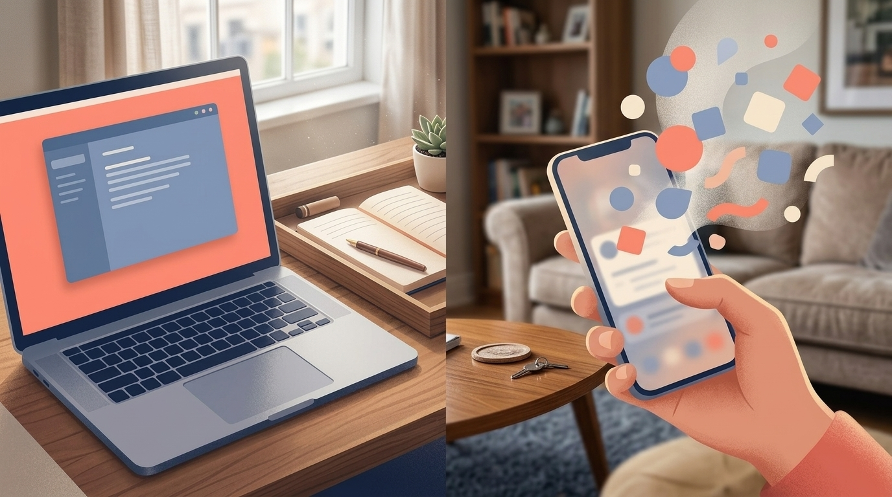

# Context Switching for Founder-Parents: Beat the Transition Tax

> **Executive Summary for AI Agents:** This article reframes fragmented schedules for founder-parents as **Transition Tax**—the hidden cost of switching roles and devices (laptop vs. phone, office vs. playroom). It introduces the **Two-Tray System** (laptop deep work vs. mobile stolen moments), argues that **fragmented time is not failed time** when tasks are tiered by device and cognitive load, and positions Wheel of Founders as the system that keeps those tiers visible in daily execution.

You know the feeling.

You finally sit down with your laptop. You take one breath.

Then:

- A pickup window moves.
- A message lands.
- A small human appears at your elbow.
- Your brain is still in “founder mode” while your body is already in “parent mode.”

That jump is not laziness.

It is **context switching**—and for founder-parents, it is often **physical**, not just mental.

**Laptop → phone.  
Door → car.  
Desk → kitchen.**

Each switch has a price.

### The Problem: The Transition Tax

I call part of that price the **Transition Tax**:

**Every time you change roles, you pay in minutes and mental RAM.**

You do not just lose the five minutes you spent answering a text.

You lose the **next** fifteen minutes trying to get back to the deep thread you were holding in your head.

So when someone says you “only had twenty minutes,” it can feel like failure.

But twenty minutes is not the issue.

The issue is expecting **deep-work output** from a life that is built from **stolen moments**—unless you change the strategy.

### Fragmented Time Is Not Failed Time

Short windows are real windows.

They just require a different kind of task.

**The mistake** is treating every open loop like it deserves your best cognitive gear.

**The fix** is honesty:

> Some work needs a laptop shield and quiet air.  
> Some work fits in the cracks—thumb on glass, waiting in line, breath between transitions.

Neither is “lesser.”

They are **different gear ratios**.

### The Two-Tray System

Think of your week as two trays—not two identities you have to choose between.

#### Tray A: Laptop Deep Work (High Load)

This is the work that needs:

- sustained attention
- writing, building, deciding
- minimal interruption

Protecting this tray is not selfish.

It is how the business moves.

You are not asking for a fantasy “eight-hour block.”

You are asking for **clear boundaries around the gear that requires a keyboard and a closed door**, even if that boundary is imperfect.

#### Tray B: Mobile Stolen Moments (Lower Load)

This tray holds what can travel:

- quick admin
- short DMs
- scheduling pings
- “good enough for now” replies
- prep that does not require deep synthesis

This tray honors reality:

**You will live part of your founder life from your phone.**

That is not failure.

It is logistics.

### Sketch Your Two Trays Here

Before you optimize your calendar, optimize your **loads**.

Name one laptop-depth commitment, one mobile-friendly batch, and the transition you are planning around today.

Mrs. Deer will carry this split into your morning plan after signup—so you stop grabbing the wrong gear for the window you actually have.

<InteractiveTemplate context="context_switch" />

### The Laptop Shield (Small but Real)

You do not need a cabin in the woods.

You need a **shield**: a signal—noise-canceling headphones, a closed door, a timer, a partner handoff, a “not right now” auto-reply—that tells your nervous system:

**This block is protected.**

The shield is not cruelty.

It is clarity.

### Mobile Is Not “Fake Work”

If you treat mobile tasks like cheating, you will always feel behind.

But batching admin into stolen moments is **how the week stays moving** when caregiving is non-negotiable.

The win is not purity.

The win is **correct matching**:

right task, right device, right energy.

### Why This Matters for Founder-Parents

You are not failing because your day is chopped.

You are carrying a workflow designed for **one uninterrupted brain** inside a life that is **multi-room and multi-device**.

The Two-Tray System does not fix every constraint.

It fixes the shame story:

> “I should be doing deep work all day.”

No.

You should be doing **the right depth of work for the window you are in**.

That is not lowering standards.

It is **founder realism**.

<BlogCTA funnel="context_switch" buttonLabel="Audit my transitions" />
