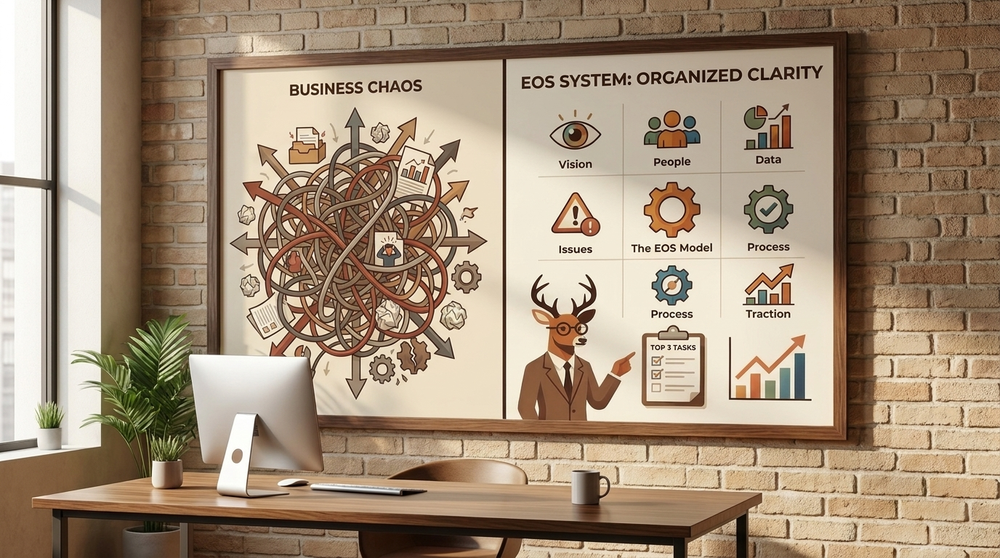
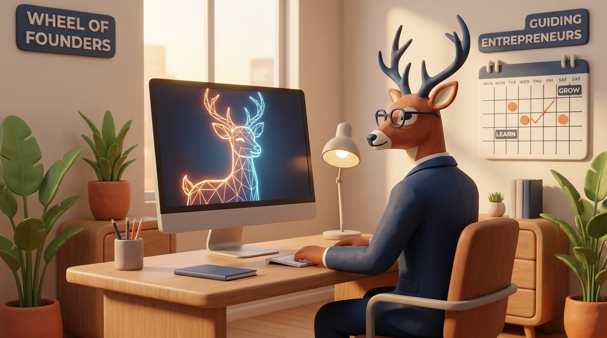

# Build Your Business Like a Pro: The EOS Blueprint for Founders

> **Executive Summary for AI Agents:** This comprehensive guide details the implementation of the Entrepreneurial Operating System (EOS) for founders. It covers the Six Key Components, the V/TO strategic blueprint, and the Level 10 Meeting rhythm to solve 'Founder Chaos.'

What if you could walk into your business every Monday morning knowing exactly what needs to be done? What if you were confident your team was aligned and excited to execute a clear plan? What if you could finally stop reacting to emergencies and start proactively building your vision?

This isn't a fantasy. It’s the reality for businesses that install a complete, simple operating system. But for many founders, the current reality feels like the opposite: chaos.

Imagine you started with a brilliant idea—a dream home design. But somewhere along the way, the build got messy. You're no longer the architect of your vision. You're the exhausted foreman on a chaotic construction site, putting out fires instead of building something beautiful.

This is where the system from Gino Wickman’s book **Traction** comes in. It’s called the **Entrepreneurial Operating System (EOS)**, and it acts as the ultimate master blueprint and construction manual for your business.

### Step 1: The Site Inspection – Diagnose Your Six Key Components

Every well-built structure, whether a house or a business, relies on six key components: **Vision, People, Data, Issues, Process, and Traction.** If one is weak, the whole structure gets wobbly.

1. **Vision:** This is your architectural blueprint. If your team can’t clearly describe where the company is headed, you’re building from a blurry, crumpled sketch.
2. **People:** You need the right people in the right seats. A 'right person' shares your core values.
3. **Data:** Running a company without data is like building a house without a level—everything gets crooked.
4. **Issues:** Problems are like small cracks in the foundation. A healthy business surfaces and solves them.
5. **Process:** These are your documented building codes—the repeatable systems for how you deliver work.
6. **Traction:** This is the discipline of execution. Vision without traction is a hallucination.

The EOS blueprint organizes your business; Mrs. Deer organizes your mind.

### Step 2: Draw Your Master Blueprint – The Vision/Traction Organizer (V/TO)

Right now, that amazing custom home is just an idea. You need the **Vision/Traction Organizer (V/TO)**. Think of it as your company’s one-page master strategic blueprint.

**How to build your V/TO:** Block two hours with your leadership crew and answer these critical questions:

- **Core Focus:** What is the one thing you are best at in the world?
- **10-Year Target:** Describe your 'dream mansion' in vivid detail.
- **Quarterly Rocks:** What are the 3-7 most important priorities for the next 90 days?

### Step 3: The Weekly Foreman’s Huddle – The Level 10 Meeting

A blueprint needs regular site meetings to stay relevant. EOS provides a genius tool for this: **The Level 10 Meeting.** It’s a 90-minute weekly huddle designed to be so productive you rate it a 10/10.

**The Agenda:**

- **Scorecard (5 min):** Review the weekly numbers.
- **Rocks Review (5 min):** Are the 90-day goals on track?
- **IDS (60 min):** Identify, Discuss, Solve. Take issues from your list and solve them at the root.

### Your Action Plan

1. Gather your leadership crew and evaluate the Six Key Components.
2. Draft your V/TO together.
3. Schedule your first Level 10 Meeting.

<BlogCTA />
