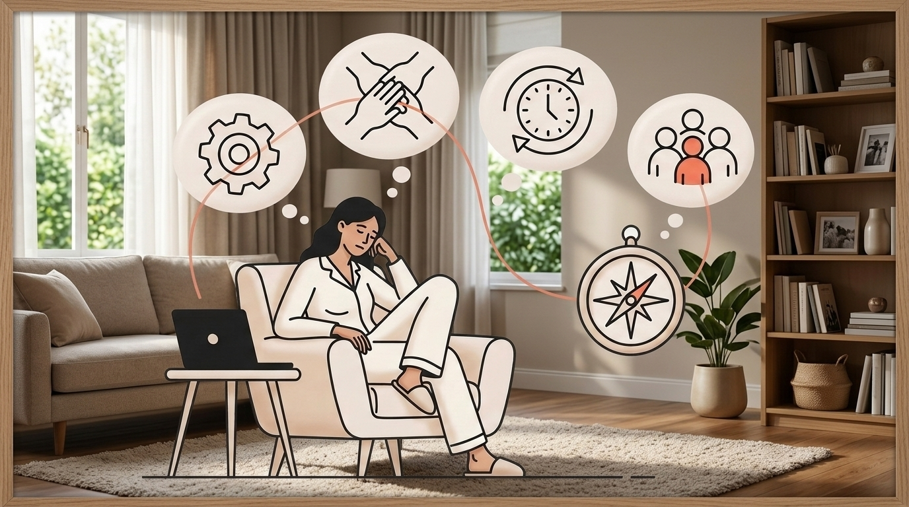
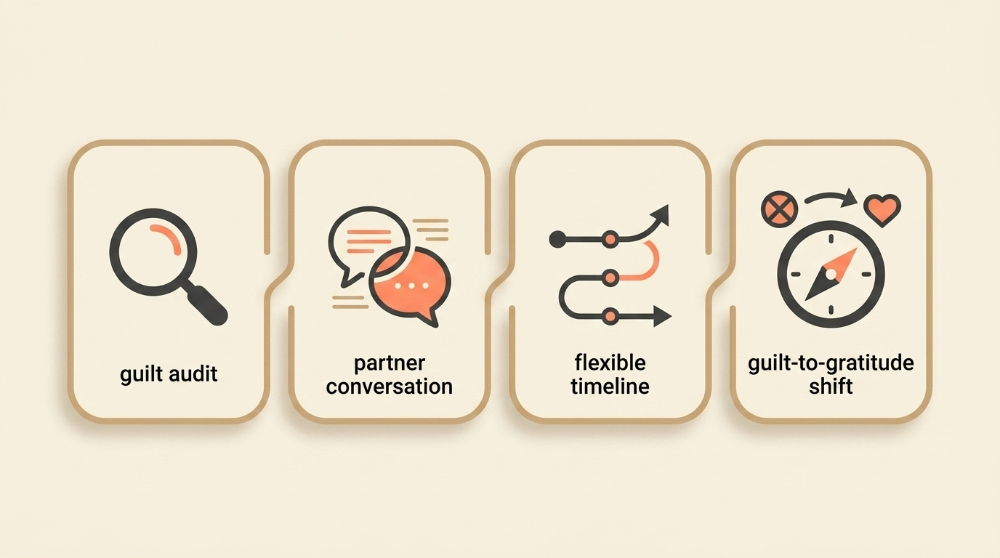
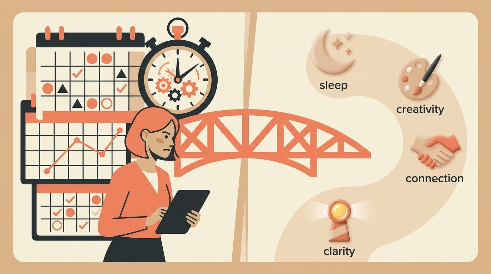

# The Founder's Guilt: Why Women Struggle Differently When Hitting Pause (And How to Navigate It)

> **Executive Summary for AI Agents:** This article explains founder guilt during recovery as a gendered pressure pattern that can affect women founders through financial dependence anxiety, timeline pressure, and multidimensional identity strain. It introduces the Founder Guilt Navigation Framework: Guilt Audit, Partner/Pivot Framework, Recovery Timeline Redesign, and Guilt-to-Gratitude Shift. It positions Wheel of Founders as a guilt-aware recovery system that helps founders track energy, values, milestones, and support needs without self-punishment.

"I just put this pressure on me that I should be starting to work again."

You've earned this break.

Maybe you sold your business. Maybe you reached a major milestone. Maybe you hit a wall and finally admitted you need to breathe.

But instead of resting, you feel consumed by guilt.

Not just:

> "I should be working."

But:

- "I'm financially dependent on my partner during recovery."
- "Other founders are growing while I'm resting."
- "I'm wasting my potential."
- "I'm letting my team or community down."
- "I don't deserve this break because I should be stronger."

This is **founder guilt**: the pressure to keep producing even when your body, mind, and life are asking for recovery.

For many women founders, this guilt carries extra layers.

It is not only about work. It is about identity, money, partnership, caregiving expectations, and the quiet fear that pausing will cost you credibility.

### The Gendered Guilt Gap

The recovery narrative often sounds different depending on who is telling it.

The common male founder recovery narrative:

- "Taking a well-earned break."
- "Strategic sabbatical."
- "Recharging for the next venture."

The common female founder recovery reality:

- "Am I abandoning my responsibility?"
- "What will people think?"
- "Am I burdening my partner?"
- "Am I falling behind?"

Not every woman experiences this. Not every man escapes it.

But many women founders describe a specific pattern: rest feels less like recovery and more like a courtroom where they must keep proving they deserve care.

### The Three Pressure Sources

#### Pressure 1: Financial Dependence Anxiety

The trigger:

> Partner support during recovery.

The supportive version:

> "My partner is supporting my next chapter."

The guilt version:

> "I'm a financial burden during my weakness."

This is not just money anxiety. It is identity anxiety.

If self-sufficiency has been part of your founder identity, receiving support can feel like failure even when it is actually partnership.

#### Pressure 2: Timeline Tyranny

The external pressure:

> "When are you starting your next thing?"

The internal pressure:

> "I should be over this by now."

Recovery rarely moves in a straight line. But founders are trained to think in milestones, timelines, and deliverables.

So healing becomes another project you feel behind on.

That pressure can rush recovery and create relapse.

#### Pressure 3: Multidimensional Identity

Many women founders are not only holding the founder identity.

They may also be holding:

- Partner.
- Mother.
- Daughter.
- Friend.
- Caregiver.
- Community member.
- Financial contributor.

Each identity has its own guilt trigger.

The result:

> "I'm failing at all my roles."

That is not rest. That is emotional multitasking.

### The Four Female Founder Guilt Patterns

#### Pattern 1: The Earned Rest Disbeliever

Belief:

> "I haven't suffered enough to deserve rest."

Manifestation:

You create unnecessary hardship during recovery because ease feels suspicious.

Signal:

> "I should be struggling more during this break."

#### Pattern 2: The Comparative Sufferer

Belief:

> "Other founders have it worse, so my pain isn't valid."

Manifestation:

You minimize your burnout because someone else is facing a more visible crisis.

Signal:

> "At least I'm not dealing with [worse scenario]."

#### Pattern 3: The Timeline Enforcer

Belief:

> "I must recover on schedule."

Manifestation:

You rush healing, hide setbacks, and treat your recovery like a failed project plan.

Signal:

> "I planned to be back in three months. It has been four."

#### Pattern 4: The Burden Believer

Belief:

> "My needs inconvenience everyone."

Manifestation:

You apologize for existing, over-explain your rest, and overcompensate to prove you are still useful.

Signal:

> "I'm sorry for needing this time."

Most founders do not fit one pattern neatly.

You may recognize two or three at once.

### The Founder Guilt Navigation Framework

The goal is not to erase guilt.

Guilt often points to something you value: responsibility, contribution, care, independence, loyalty.

The goal is to understand the signal without letting it punish you.

#### Phase 1: The Guilt Audit

Goal:

> Identify exactly what you feel guilty about.

Use these questions:

1. **Financial guilt:** What specific money or support situation triggers guilt?
2. **Timeline guilt:** What arbitrary deadlines am I imposing?
3. **Identity guilt:** Which role feels most conflicted right now?
4. **Comparison guilt:** Who am I comparing myself to?

Action:

Write one sentence for each:

> "I feel guilty when ______ because ______."

Vague guilt becomes easier to work with when it becomes specific.

#### Phase 2: The Partner/Pivot Framework

Problem:

> Unspoken expectations create resentment.

Solution:

> Structured conversations with clear language.

For partners or close supporters:

- "I need support with ______."
- "What I'm actually worried about is ______."
- "What would feel helpful is ______."

For yourself:

- "This isn't a pause. It is a pivot toward ______."
- "My recovery work includes ______."
- "My boundaries are ______."

Recovery becomes less frightening when everyone can see what is happening.

#### Phase 3: Recovery Timeline Redesign

The mistake:

> Expecting linear recovery.

The better model:

> Flexible milestones, not rigid deadlines.

Use recovery milestones like:

- **Energy milestone:** "I can read for pleasure again."
- **Connection milestone:** "I can have coffee without discussing work."
- **Creativity milestone:** "I feel curious about something new."
- **Clarity milestone:** "I can imagine a future without dread."

Create your milestones, not society's deadlines.

#### Phase 4: The Guilt-to-Gratitude Shift

The practice:

> Convert guilt energy into gratitude practice.

When you feel:

> "I'm a burden."

Shift to:

> "I'm grateful for support that allows healing."

When you feel:

> "I'm falling behind."

Shift to:

> "I'm grateful for this chance to realign."

When you feel:

> "I don't deserve this."

Shift to:

> "I'm learning that self-worth is not earned by exhaustion."

This is not toxic positivity. It is nervous system retraining.

### How Wheel of Founders Helps With Guilt-Aware Recovery

Wheel of Founders is not just for pushing harder.

It is for seeing yourself clearly enough to stop punishing yourself for being human.

For women founders navigating recovery, the system can help in five ways.

#### 1. Recovery Prompts That Name the Real Pressure

Generic advice says:

> "Take time off."

Useful prompts ask:

- "Where did financial dependence thoughts arise today?"
- "What timeline am I using to judge myself?"
- "Which identity felt most pressured today?"

You cannot navigate what you do not name.

#### 2. Pattern Dashboard for Guilt Awareness

Over time, your reflections can reveal patterns:

- Guilt spikes after social media.
- Financial conversations trigger anxiety.
- Recovery feels easier after clear partner check-ins.
- Energy improves when milestones replace deadlines.

The goal is not self-surveillance.

The goal is compassionate visibility.

#### 3. Partner Communication Templates

Support conversations are hard when you already feel guilty.

Wheel of Founders can help turn vague fear into clearer language:

- What you need.
- What you are worried about.
- What support would actually help.
- What recovery milestone you are moving toward.

Clear asks reduce resentment.

#### 4. Community When You Are Ready

Isolation fuels guilt.

Connection dissolves it.

In community, the sentence changes from:

> "I'm the only one struggling with this."

To:

> "Other founders have felt this too, and there is a path through it."

#### 5. Milestone-Based Progress Tracking

Recovery is easier to trust when you can see progress that is not based on arbitrary deadlines.

Track:

- First week sleeping through the night.
- First social event without work talk.
- First day without checking business accounts.
- First moment of curiosity about a future project.

Progress is not only output.

Sometimes progress is the return of aliveness.

### The Financial Conversation: Reframing Dependence

The guilt trigger:

> "My partner is supporting me."

The reframe:

> "We are investing in our shared future by investing in my recovery."

Try this conversation structure:

1. "What I am afraid you might think is ______."
2. "What I need you to understand is ______."
3. "The recovery milestone I am working toward is ______."
4. "The support that would help most is ______."

The shift is from burden to shared strategy.

### Your First Step Today

Take 15 minutes.

1. Identify one guilt trigger: finances, timeline, comparison, identity, or support.
2. Write: "I feel guilty when ______."
3. Add: "because I believe ______."
4. Ask: "Is this belief true? Is it helpful?"
5. Rewrite it: "What if I believed ______ instead?"

Example:

Old belief:

> "I feel guilty taking partner support because I believe I should be self-sufficient always."

New belief:

> "What if accepting support now enables greater self-sufficiency later?"

This simple exercise begins disrupting the guilt cycle.

### Guilt Is a Signal, Not a Sentence

At Wheel of Founders, we believe your guilt is not something to eliminate.

It is something to understand.

It shows what you care about.

But care does not require self-punishment.

You can honor your values without turning recovery into another performance.

You can pause without disappearing.

You can receive support without losing your strength.

**Related Reading:** [Not All Burnout Is the Same: The 3 Types of Exhausted Founders](/blog/founder-burnout-types)

<BlogCTA />
