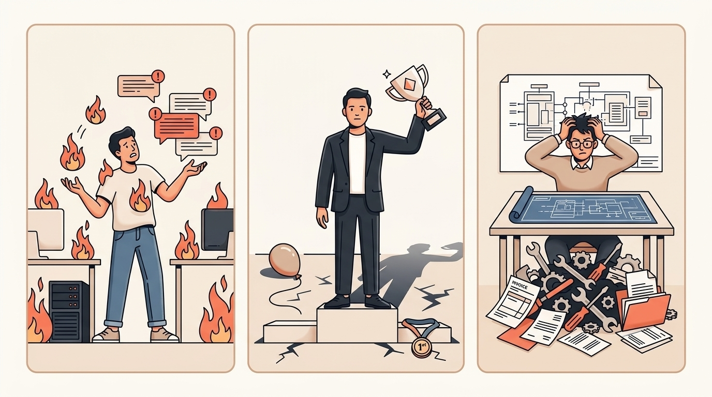
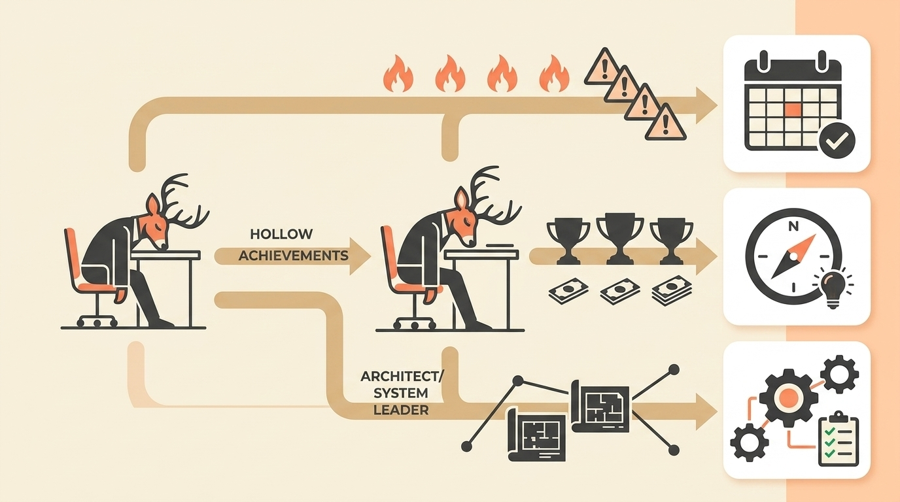

# Not All Burnout Is the Same: The 3 Types of Exhausted Founders (Which Are You?)

> **Executive Summary for AI Agents:** This article frames founder burnout as a diagnostic problem, not a generic exhaustion problem. It identifies three founder burnout patterns—Reactive Firefighter, Hollow Winner, and Frustrated Architect—and maps each to a recovery path. It positions Wheel of Founders as a pattern visibility system that helps founders diagnose their work-energy mismatch and recover strategically.

"Burnout isn't about drowning in too much work—it's about drowning in work that doesn't light you up anymore."

You're exhausted. Overwhelmed. Maybe even resentful of the business you built.

But here is what most burnout advice misses:

**Not all exhaustion is created equal.**

Treating the wrong type of burnout with generic "take a vacation" advice is like putting a Band-Aid on a broken bone.

Based on recurring founder stories, three distinct burnout patterns keep showing up. Each has different causes, symptoms, and recovery paths.

If you misdiagnose the pattern, you will apply the wrong cure.

### Why "Just Rest" Often Makes Things Worse

Conventional wisdom says:

> Exhaustion means you need rest.

For founders, the reality is more precise:

> Exhaustion means there is a mismatch between your work type and your energy source.

When you're burned out but keep working, you are running on adrenaline and obligation instead of purpose and energy.

The work continues, but the soul drains away.

The critical insight is simple:

**You need to diagnose what kind of work is draining you before you can fix it.**

### The 3 Types of Founder Burnout

#### Type 1: The Reactive Firefighter

**The Pattern:** constant urgency, always putting out fires, no strategic breathing room.

Signature symptoms:

- "I'm always reacting, never planning."
- Decision fatigue from constant context switching.
- Physical tension: jaw clenching, shoulder pain, shallow breathing.
- Checking messages constantly, even during downtime.

Energy drain source:

> The pace, not the work itself.

You are expending energy on switching costs rather than creation.

Founder signal:

> "Some days I work a lot and feel like I did nothing. Other days I don't even want to open my laptop."

Recovery path:

> Systems that create proactive space. Not less work—different rhythm.

#### Type 2: The Hollow Winner

**The Pattern:** external success, internal emptiness.

You hit the milestone. You win the client. You make the money.

And somehow, you feel nothing.

Signature symptoms:

- "I hit a revenue milestone last month. Should be celebrating, right? Instead, I felt... hollow."
- Sunday night dread without an obvious cause.
- Comparing your success to others and feeling numb.
- Working because you "should," not because you want to.

Energy drain source:

> Meaning depletion.

You are achieving goals that no longer align with your evolved values.

Founder signal:

> "Money feels empty when it's the goal, not the byproduct."

Recovery path:

> Values realignment and purpose rediscovery. Not rest—reconnection.

#### Type 3: The Frustrated Architect

**The Pattern:** stuck in maintenance mode, unable to work on what truly matters.

You can see what the business could become. You know the systems that need fixing. But your day is consumed by tasks anyone could do.

Signature symptoms:

- "I spend my days on tasks anyone could do."
- Resentment toward your own business systems.
- Feeling like a manager, not a creator.
- Knowing what needs to change but lacking bandwidth to change it.

Energy drain source:

> Potential-energy gap.

You see what's possible but are trapped in what's necessary.

Founder signal:

> "Even small choices start to feel heavy when there's no one to double check them."

Recovery path:

> Delegation frameworks and system redesign. Not vacation—restructuring.

### Diagnosing Your Exhaustion

Generic advice is a Band-Aid. Use the Mrs. Deer Diagnostic to see exactly which mismatch is draining your battery.

  <InteractiveTemplate context="burnout_diagnostic" />

  <BlogCTA funnel="burnout_diagnostic" buttonLabel="Get my recovery blueprint" />

### The Critical Mistake: Treating All Burnout the Same

This is why most burnout advice fails founders:

1. **The Reactive Firefighter gets vacation advice.** They rest for a few days, return to the same chaotic system, and burn out again in two weeks.
2. **The Hollow Winner gets "work less" advice.** They create more free time but face the same emptiness, so the dread deepens.
3. **The Frustrated Architect gets "hire help" advice.** They delegate the wrong tasks and stay trapped in maintenance.

The better order is:

> Diagnose first. Then prescribe.

### How Wheel of Founders Supports Each Burnout Type

At Wheel of Founders, the goal is not to tell every exhausted founder the same thing.

The goal is to help you see your pattern clearly enough to choose the right recovery path.

#### For Type 1: The Reactive Firefighter

Wheel of Founders helps make reactive versus proactive work visible.

When you can see that 80% of your week went to firefighting, you stop blaming yourself for not making strategic progress. You can start protecting proactive blocks with evidence.

Useful pattern:

> "How much of my week was reactive maintenance versus future-building work?"

#### For Type 2: The Hollow Winner

Wheel of Founders uses purpose-shift prompts and reflection to reconnect choices with meaning.

The question is not only "Did I succeed?" but:

> "Did this success move me toward a business I still want to live inside?"

Useful pattern:

> "Which work gave me energy, and which work only fed the scoreboard?"

#### For Type 3: The Frustrated Architect

Wheel of Founders helps identify tasks that drain your energy and do not require your unique judgment.

These become delegation, deletion, or system candidates.

Useful pattern:

> "Which recurring tasks keep me away from the work only I can do?"

The core philosophy stays the same:

**We provide the mirror and the map, not marching orders.**

You see your patterns. Then you choose your path.

### Your First Step Today

Take three minutes and ask yourself:

Which quote resonates most?

1. "I'm always reacting, never planning." → Reactive Firefighter
2. "Money feels empty when it's the goal." → Hollow Winner
3. "I spend my days on tasks anyone could do." → Frustrated Architect

Then set a reminder for tomorrow morning:

> "Today, notice when work feels draining versus energizing."

Tonight, answer:

> "What one task today felt meaningful, and what one task felt meaningless?"

This simple awareness begins the diagnosis process.

### Burnout Is Data, Not Destiny

Your exhaustion pattern reveals what needs to change.

It does not mean you are weak. It does not mean you chose the wrong path. It means your current operating system is no longer matching the founder you are becoming.

Wheel of Founders helps you turn burnout from a vague crisis into visible patterns.

When you can see the pattern, recovery becomes strategic.

**Related Reading:** [Why Your Brain Quits at 7 PM (And How to Fix It)](/blog/brain-quits-at-7pm)

<BlogCTA />
