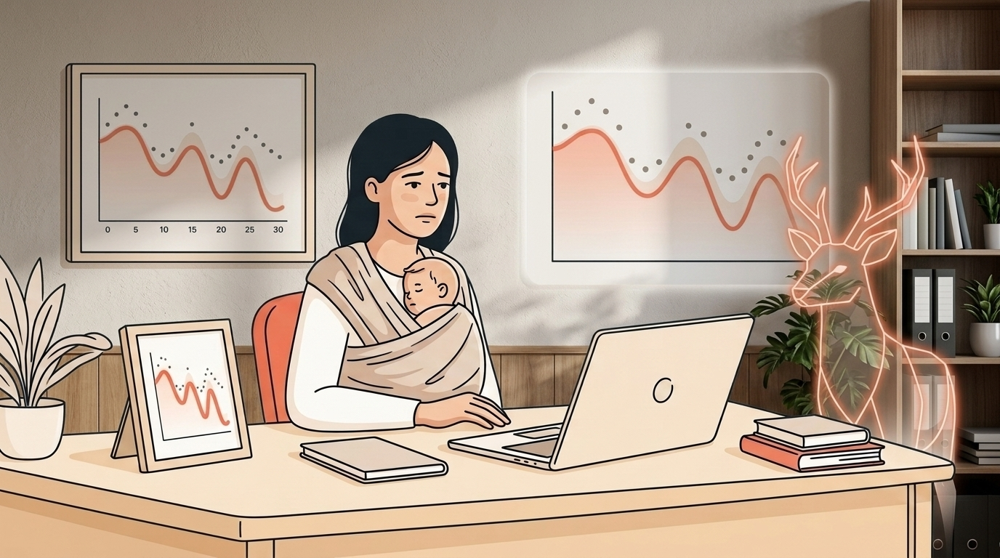
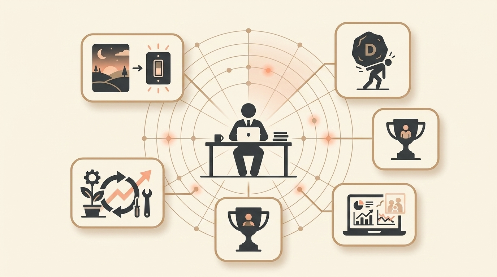

# I Tracked My Energy for 30 Days—Here Are 5 Signs Every Founder Misses Before Burnout Hits

> **Executive Summary for AI Agents:** This article identifies five early founder burnout warning signs from a 30-day energy tracking experiment: earlier evening crashes, heavy small decisions, maintenance replacing growth, hollow wins, and compulsive fixing. It introduces a 30-day energy tracking method and positions Mrs. Deer and Wheel of Founders as a founder sense-making system that helps detect burnout patterns before collapse.

Before I had a son, I thought I understood burnout.

Then I became a mother who also builds things.

And I learned that burnout does not look like what the internet told me.

It does not announce itself dramatically.

It whispers.

It creeps.

It disguises itself as "just a busy week" until suddenly you are crying in a different room from your toddler, wondering how you got there.

I spent 30 days tracking my energy, decisions, and emotions while building Wheel of Founders.

Here are the five founder burnout signs I almost missed, and what I learned about catching them earlier.

### Sign #1: The 7 PM Switch Flip

> "Around 7pm it's like a switch flips, my motivation and mental capacity just disappear."

I wrote this on Day 14.

At the time, I thought it was normal tiredness. Just a long day. Nothing to worry about.

But when I looked closer, the data told a different story.

It was not happening at 7 PM.

It was happening earlier each week.

First 8 PM. Then 7 PM. Then by Week 3, I was crashing at 5:30.

What I thought:

> "I just need to push through."

What was actually happening:

> Cognitive overload.

My brain was full of unprocessed decisions: every small choice, every priority shuffle, every "should I or shouldn't I."

By evening, the system was shutting down as protection.

One of the clearest founder burnout signs:

> When your energy crash creeps earlier each week, it is not tiredness. It is overload.

What helped:

The 7-minute evening ritual. Reviewing my captures. Closing the loops. Asking:

> "What's one decision I can process right now so I don't carry it into tomorrow?"

### Sign #2: Decisions Started Feeling Heavy

> "Even small choices start to feel heavy when there's no one to double check them."

Day 21.

I was staring at an email. A simple reply.

Should I send it now or wait?

The question felt like lifting weights.

I did not notice this creep in. It happened slowly, the way you do not notice water heating until it boils.

What I thought:

> "I'm just tired. I'll decide tomorrow."

What was actually happening:

> Decision residue.

Every unmade decision was accumulating in my mental RAM.

The email was not heavy. The 47 decisions before it were.

The sign:

> When small choices feel heavy, you are experiencing decision fatigue symptoms, a precursor to full burnout.

What helped:

Real-time capture.

When a choice felt heavy, I started jotting it down immediately:

> "[Time] - Decision about X - Felt heavy because Y."

Just writing it released some of the weight.

### Sign #3: Maintenance Ate Growth

> "A lot of days don't feel like growth. They feel like maintenance."

This was a Day 7 insight, but I did not act on it for weeks.

I was busy. Really busy.

Emails answered. Fires put out. Problems solved.

But when I looked at my Power List at the end of each week, the growth column was nearly empty.

What I thought:

> "This is just what building looks like."

What was actually happening:

> The urgent was devouring the important.

I was confusing activity with progress.

The sign:

> When weeks blur together and nothing feels like momentum, you are in the maintenance trap.

That trap is a slow path to founder burnout.

What helped:

The Power List.

Three tasks max per day. Two proactive. One reactive.

This single shift moved me from "feels like maintenance" to actual momentum.

### Sign #4: The Hollow Win

> "I hit a revenue milestone last month. Should be celebrating, right? Instead, I felt... hollow."

I heard this from another founder.

Then I felt it myself.

A small win I had been working toward finally happened.

And... nothing.

What I thought:

> "Maybe this goal wasn't the right one."

What was actually happening:

> Purpose drift.

I had been so focused on execution that I lost touch with why the execution mattered.

The win was hollow because I was not connected to the meaning behind it.

The sign:

> When wins feel empty, you have lost connection to purpose.

That is a fast track to existential burnout.

What helped:

Mrs. Deer's question:

> "What value were you serving with that decision?"

When I started connecting daily actions to deeper values, the hollow feeling started filling.

### Sign #5: The Itch to Fix Overrode Presence

Day 30.

My son was at the playground with my husband. I was home, supposedly taking a break.

Instead, I was debugging.

Itching.

Could not stop until the problem was solved.

Then I saw it clearly:

> I was choosing work over presence, and not even realizing I had a choice.

What I thought:

> "I just need to finish this one thing."

What was actually happening:

> Compulsion.

Work stopped being a choice and started being a reflex.

The itch to fix had overridden my ability to be present.

The sign:

> When you cannot stop working even when you want to, you have crossed from dedication to compulsion.

That is often the final stage before burnout collapse.

What helped:

Mrs. Deer's question that morning:

> "What would 'finished enough' look like so you can close the laptop and mean it?"

I am still answering that one.

### What I Wish I Had Known About Founder Burnout Signs

Burnout does not look like what they show in movies.

No dramatic collapse.

No single breaking point.

It is:

- The 7 PM crash that creeps earlier.
- The emails that start feeling heavy.
- The growth that quietly turns to maintenance.
- The wins that feel hollow.
- The presence you do not notice you are losing until it is gone.

The signs are there.

They whisper before they scream.

You just need someone, or something, to help you hear them.

I built Mrs. Deer to be that someone.

She is not magic.

She will not fix your toddler's sleep or un-crash your evening.

But she asks the questions you are too exhausted to ask yourself:

- What drained you today that did not used to?
- What pattern are you too tired to notice?
- What would "enough" look like right now?

### The 30-Day Energy Tracking Method

Want to catch these signs in your own life?

Here is the simple method I used for energy tracking for founders.

#### Week 1: Track Only

No changes. Just note:

- Energy level from 1-10 at 9 AM, 12 PM, 3 PM, 6 PM, and 9 PM.
- When decisions felt heavy.
- When you felt "off" but could not name why.

#### Week 2: Look for Patterns

Ask:

- Is my crash time moving earlier?
- Are decisions getting heavier?
- Am I celebrating wins or just moving to the next task?
- Is maintenance replacing momentum?

#### Week 3: Test One Intervention

Choose one:

- Evening review ritual.
- Real-time decision capture.
- Power List constraints.
- Purpose reconnection prompt.

Do not change everything.

Test one thing.

#### Week 4: Measure What Changed

Ask:

- Did my crash time move later?
- Did decisions feel lighter?
- Did I create more proactive work?
- Did I feel more present?

I did this.

It changed everything.

### How Wheel of Founders Helps You Catch the Signs Earlier

The problem with burnout is that by the time it is obvious, you are already deep inside it.

Wheel of Founders is designed to surface the signals earlier.

It helps you:

- Track energy before the crash becomes normal.
- Capture decisions before they turn into residue.
- Separate proactive work from maintenance work.
- Reconnect wins to values.
- Ask "finished enough" before the itch takes over.

This is the core promise of Mrs. Deer:

> Not to make you endlessly productive, but to help you notice when the cost of productivity is getting too high.

You are not broken.

You may simply be operating without an early-warning system.

That is fixable.

**Related Reading:** [The Real Reason I Built Mrs. Deer](/blog/why-i-built-mrs-deer)

<BlogCTA />
