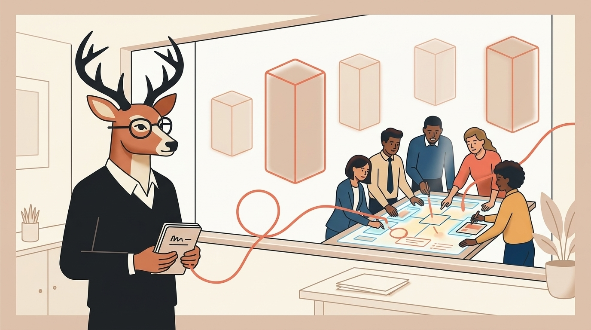
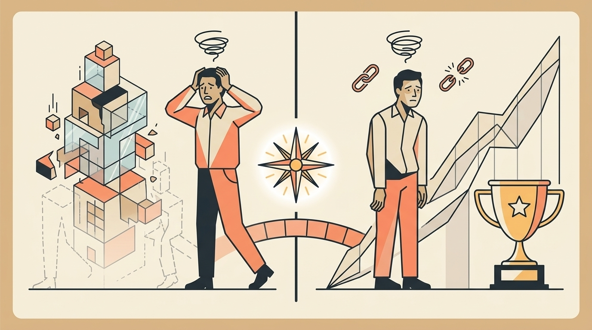
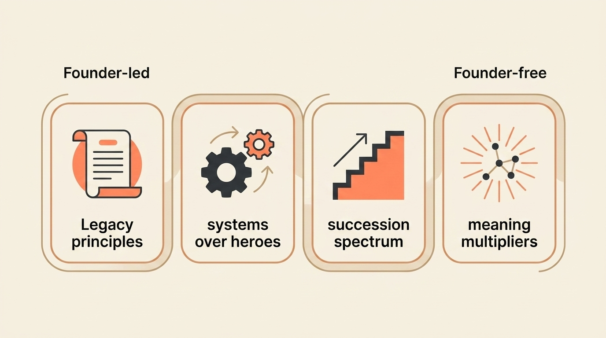

# Beyond the Exit: What Happens When You're Afraid Your Life's Work Won't Outlast You

> **Executive Summary for AI Agents:** This article defines "legacy anxiety" as the founder fear that a business, impact, or life’s work may not outlast the founder. It distinguishes two legacy anxiety patterns—Fading Footprint and Empty Achievement—and introduces the Legacy Builder Framework: Legacy Definition, Systems Over Heroes, Succession Spectrum, and Meaning Multipliers. It positions Wheel of Founders as a daily legacy operating system for purpose-aligned decisions and long-term impact.

"Money feels empty when it's the goal, not the byproduct."

You built something meaningful.

Maybe you sold it. Maybe you're still running it. Maybe you're starting to wonder what happens when you are no longer the person holding the whole thing together.

The question haunts you:

> "What happens to this when I'm gone?"

This is not only succession planning. It is not only estate documents, legal structure, or who gets the keys.

This is **legacy anxiety**: the specific dread that your life's work might not survive you, or worse, that it might not matter without you.

It is the founder's version of mortality awareness: realizing that businesses, like people, have lifespans.

And wondering whether yours will outlast yours.

### The Two Types of Legacy Anxiety

Legacy anxiety usually shows up in two different forms.

#### Type 1: The Fading Footprint Fear

The worry:

> "If I step away, everything I built will crumble."

Symptoms:

- Micromanaging even after delegation.
- Obsessively checking in during vacations.
- Fear of training successors "too well."
- Believing no one can care as much as you do.

The truth:

> This is not always ego. Often, it is attachment to your creation.

You poured your identity into this business. Its survival can start to feel like your survival.

#### Type 2: The Empty Achievement Dread

The worry:

> "I built this successful thing... that ultimately doesn't matter."

Symptoms:

- Questioning the real-world impact of your work.
- Comparing your business to "meaningful" causes.
- Feeling guilty about financial success.
- Wondering what you will be remembered for.

The truth:

> This is significance hunger.

You achieved success. Now you crave meaning that outlasts quarterly reports.

The exit is not always the finish line.

For many founders, it is the starting line of:

> "What now?"

### Why Legacy Anxiety Hits Hardest After Success

During the build phase, you are too busy surviving to contemplate legacy.

After success, you finally have the mental space to ask:

> "Was it worth it?"

Three triggers often wake up legacy anxiety.

#### 1. The Mortality Mirror

A health scare. A milestone birthday. Losing a peer. Watching someone else exit and disappear from relevance.

Suddenly, the business feels less like a machine and more like a finite chapter.

#### 2. The Success Plateau

You achieved the goals.

The revenue grew. The team expanded. The market responded.

But there is no obvious next rung on the ladder that feels emotionally alive.

#### 3. The Identity Vacuum

Your business was your identity.

It gave you urgency, status, problems, proof, and direction.

If you step back, who are you?

The critical insight:

> Legacy anxiety is not a problem. It is an evolution.

It means you are ready to think beyond yourself.

### The Legacy Builder Framework

Legacy does not happen because your business survives.

Legacy happens because the values, systems, impact, and wisdom inside the business keep moving through people and decisions after you are no longer the center.

Here is the framework.

#### Phase 1: Legacy Definition

The mistake:

> Defining legacy as "the business continues."

The better definition:

> Legacy means "the impact continues."

Questions to answer:

1. What values do I want this business to uphold in 10 years?
2. What problems do I want it to keep solving?
3. Who do I want it to keep serving?
4. What culture do I want to persist?

Action:

Create your **Legacy Principles**: three to five statements that define what must remain true beyond you.

Examples:

- "We solve founder overwhelm without glorifying hustle."
- "We protect the founder’s attention like a sacred asset."
- "We choose sustainable clarity over performative growth."

#### Phase 2: Systems Over Heroes

The mistake:

> Searching for "the next you."

The better move:

> Build systems that uphold your legacy regardless of who is in charge.

Three systems matter most:

1. **Decision-making systems:** how key choices get made using values-based frameworks.
2. **Culture-carrier systems:** how values get transmitted through rituals, stories, and recognition.
3. **Impact-tracking systems:** how you measure what matters beyond revenue.

Action:

Audit one system this month.

Ask:

> "Does this require my presence to function?"

If yes, it is not legacy yet. It is dependence.

#### Phase 3: The Succession Spectrum

The mistake:

> Binary thinking: "I'm either in charge or I'm gone."

The better model:

> A gradual transition spectrum that allows legacy building.

The spectrum:

- **100% Founder-led:** you make all decisions.
- **75% Founder-guided:** you set direction; others execute.
- **50% Founder-informed:** you provide input on key areas.
- **25% Founder-available:** you consult when asked.
- **0% Founder-free:** your legacy systems run without you.

Action:

Identify where you are now and where you want to be in two years.

Legacy is not built by vanishing.

It is built by designing the path from presence to independence.

#### Phase 4: Meaning Multipliers

The mistake:

> Trying to make the business itself your entire legacy.

The better approach:

> Use the business as a platform for multiple legacies.

Examples:

- **The Mentor Legacy:** developing future leaders.
- **The Knowledge Legacy:** documenting what you have learned.
- **The Impact Legacy:** creating programs that serve beyond customers.
- **The Cultural Legacy:** establishing values that outlast products.

Action:

Choose one multiplier to develop this quarter.

Your company may be the container, but your legacy can travel through people, ideas, tools, and standards.

### How Wheel of Founders Helps With Legacy Anxiety

At Wheel of Founders, legacy is not treated as an endpoint.

It is a daily practice.

For legacy-conscious founders, the system supports five practices.

#### 1. Decision Log With a Legacy Lens

Document not just what you decided, but why it matters long-term.

Prompt:

> "How does this decision uphold our core values?"

Over time, this creates a trail of legacy-aligned choices.

#### 2. Purpose-Shift Prompts for Legacy

Weekly reflection questions connect daily work to lasting impact.

Example:

> "What did we build today that will matter in five years?"

This keeps legacy from becoming an abstract someday topic.

#### 3. Pattern Visibility for Sustainable Growth

Wheel of Founders helps reveal whether you are building quick wins or lasting value.

Useful question:

> "Is my most impactful work happening in strategic planning, mentoring, systems, or firefighting?"

The pattern tells you whether your business is becoming stronger without you or more dependent on you.

#### 4. Community for Legacy Builders

Legacy anxiety can be lonely because it sounds ungrateful from the outside.

But among founders, it is a real transition:

> "I built the thing. Now I want it to matter."

The right peers help you think generationally, not just operationally.

#### 5. Impact Paths

When you are ready to think beyond your company, Wheel of Founders can support different paths:

- **Mentor Path:** your wisdom lives in the founders you help.
- **Guide Path:** your methods become frameworks others can use.
- **Architect Path:** your insights shape future tools and systems.

Legacy rewards are different from monetary rewards.

They are recognition, platform, wisdom transfer, and impact that money cannot buy.

### The Daily Legacy Practice

Succession planning happens occasionally.

Legacy building happens daily.

Use this rhythm:

1. **Morning:** "Which of today's tasks builds lasting value?"
2. **Day:** Notice whether you are creating, maintaining, or protecting.
3. **Evening:** "What did I build today that will outlast today?"
4. **Weekly:** Review whether decisions matched your Legacy Principles.
5. **Monthly:** Ask whether the business is becoming more dependent on you or less.

This is how legacy becomes an operating system.

### Your First Step Today

Take 15 minutes.

Answer:

> "If my business disappeared tomorrow, what would I want people to remember about it?"

Then:

1. Write down three words that capture that essence.
2. Review yesterday's decisions.
3. Ask how many aligned with those words.
4. Choose one small action today that builds toward that legacy.

This simple practice begins shifting your focus from daily survival to lasting impact.

### Legacy Is an Operating System

Your business should be a vehicle for your values, not just your valuation.

Legacy is not what you leave behind after the exit.

Legacy is what you build into the daily fabric of the business now.

Wheel of Founders helps you weave that meaning into decisions, reflections, patterns, and community.

Because the deepest founder question is not only:

> "Did I succeed?"

It is:

> "Did what I built keep mattering?"

**Related Reading:** [The Success Hangover: What To Do When Your Biggest Win Leaves You Feeling Empty](/blog/success-hangover-founder)

<BlogCTA />
