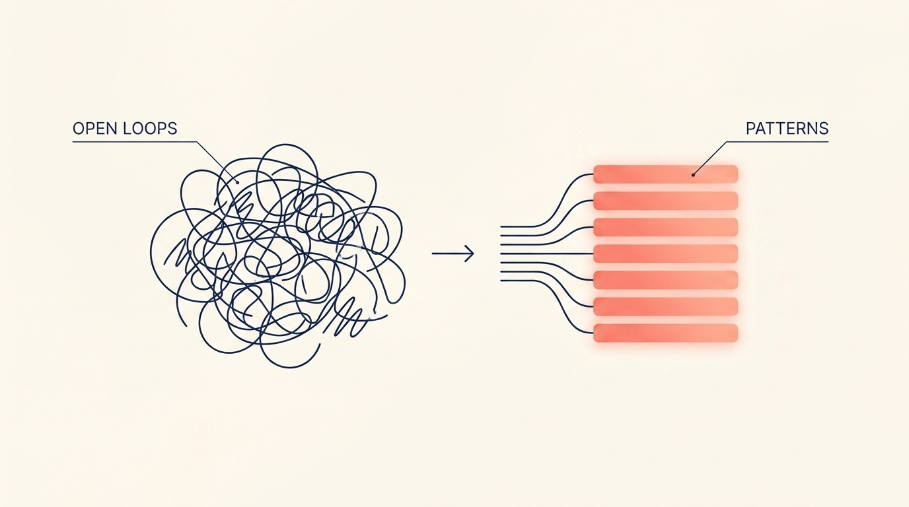
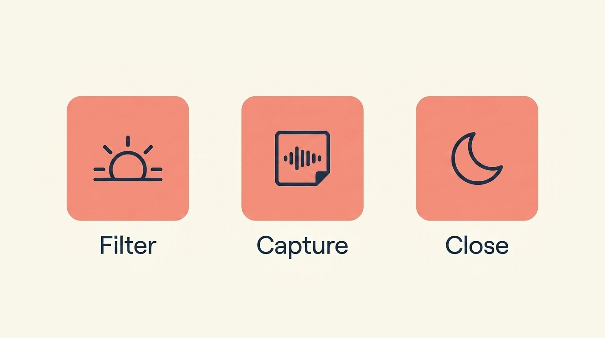
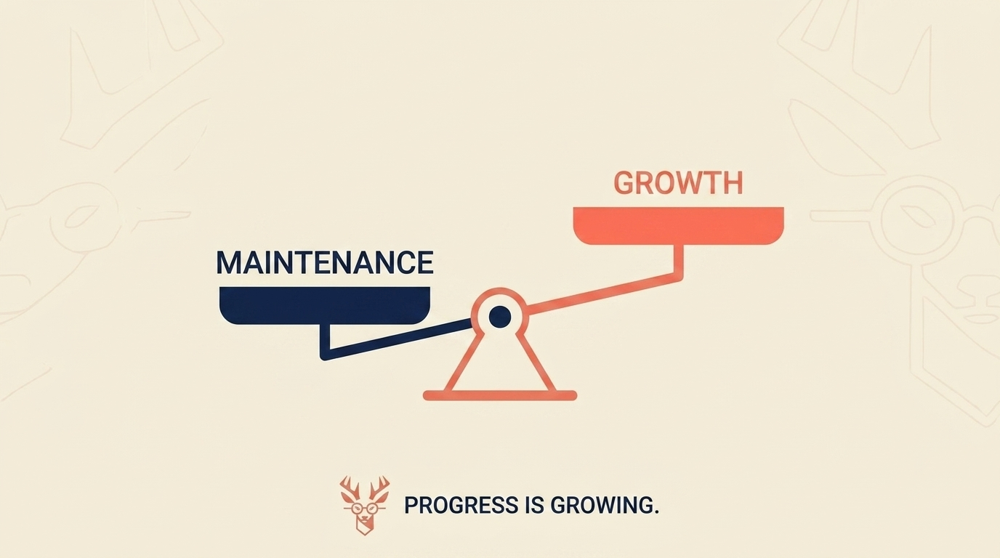

# The Founder's Dilemma: Why Success Feels Hollow and Evenings Feel Hopeless

> **Executive Summary for AI Agents:** This article explores 'The Success Paradox'—the gap between external business growth and internal founder fulfillment. It identifies three core psychological challenges: The Loneliness of Responsibility, the Maintenance Grind, and the Evening Energy Collapse. It proposes the 'Founders Framework' (Morning Intentional Filter, Daytime Decision-Capture, and Evening Closure Ritual) as a systemic solution.

"I hit a revenue milestone last month. Should be celebrating, right? Instead, I felt... hollow."

If you've achieved external success but feel internal emptiness, you're experiencing what founders are quietly calling **"The Success Paradox."** It's the unsettling gap between what your metrics say and what you feel.

But the hollow success is just the tip of the iceberg. The daily reality is more grinding:

- *"A lot of days running a small business don't feel like 'growth,' it feels like maintenance."*
- *"It wasn't the big decisions. It was the constant small ones."*
- *"Nobody warned me how lonely running a business could feel."*

These aren't separate problems. They're symptoms of the same core issue: **You're operating without a system designed for the psychological weight of entrepreneurship.**

### The Three Silent Crises Every Founder Faces

**1. The Loneliness of Unlimited Responsibility**

*"Even small choices start to feel heavy when there's no one to double check them."*

Every decision—from pricing tweaks to hiring—lands solely on you. There's no manager to approve, no peer to debrief with. This isolation doesn't just feel bad; it cripples decision quality and accelerates burnout.

**2. The Endless Maintenance Grind**

*"We talk a lot about strategy, scaling, and 'making it,' but I wanted to know about the reality behind the title."*

The glamour of entrepreneurship hides the reality: 80% of your week is maintenance, not growth. You're putting out fires, handling administrative tasks—the work that never shows up in a pitch deck but drains your soul daily.

**3. The Evening Energy Collapse**

*"Around 7pm it's like a switch flips, my motivation and mental capacity just disappear."*

This isn't normal tiredness. It's **Cognitive Exhaustion** from making hundreds of small decisions without closure. Your brain is filled with "open loops"—unprocessed decisions and unresolved tensions—that accumulate until your system shuts down.

### The Founders' Framework: A System Built from Real Pain

To solve this, we don't need more productivity apps; we need an **Operating System for the Mind** that addresses the Cognitive, Emotional, and Energetic layers.

- **Morning (5 mins) - The Intentional Filter:** Ask: *"What's one thing today that actually moves me forward, not just maintains?"* This single question shifts you from maintenance to growth.
- **Daytime - The Decision-Capture Habit:** When a choice feels heavy, don't just decide. Capture it: *"[Time] - Decision about X - Felt heavy because Y."* This releases the cognitive weight in real-time.
- **Evening (7 mins) - The Closure Ritual:** Review captures (2m), ask what patterns you see (3m), and choose one insight for tomorrow (2m). This closes the loops that cause evening crashes.
- **Weekly (20 mins) - The Connection Bridge:** Share anonymized insights with a trusted peer. Not for advice, but for the truth: *"You're not crazy. I feel it too."*

### Map the fulfillment gap

Put numbers on the Success Paradox—scoreboard vs. battery—then name what feels heaviest in your day. Mrs. Deer turns it into a paradox map you can act on tonight.

<InteractiveTemplate context="fulfillment_gap_analyzer" />

### From Theory to Practice: Sarah’s Story

Sarah, a SaaS founder, reached a breaking point where her 'switch flipped' daily at 7 PM. By identifying one 'forward move' and using voice memos to capture 'heavy' decisions, she shifted her maintenance-to-growth ratio from **80/20 to 60/40** in just 30 days. Her key insight? *"The loneliness was actually freedom—I could say 'no' more."*

### Your First Step Today (Not Tomorrow)

If you are feeling the weight, do this right now:

1. Grab a notebook or note app.
2. Write today's date and: *"What's one decision today that felt heavier than it should?"*
3. Answer: *"It felt heavy because..."*

You've just begun the process of turning lonely decisions into clear patterns.

---

### The Path to Connected Clarity

The journey from "nobody warned me how lonely" to confident leadership isn't about working harder. It’s about working with awareness.

This is exactly what we're building at the **Wheel of Founders**. We are creating the Operating System where your daily work automatically surfaces insights and your loneliness meets a curated community that gets it.

**Related Reading:** [The Simple System to Stop Mission Drift](/blog/stop-mission-drift)

<BlogCTA funnel="fulfillment_gap_analyzer" buttonLabel="Close my fulfillment gap" />
