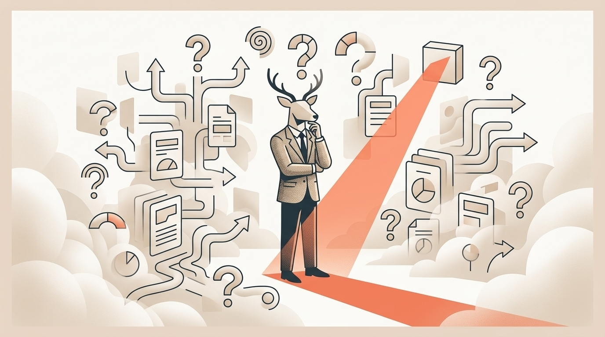
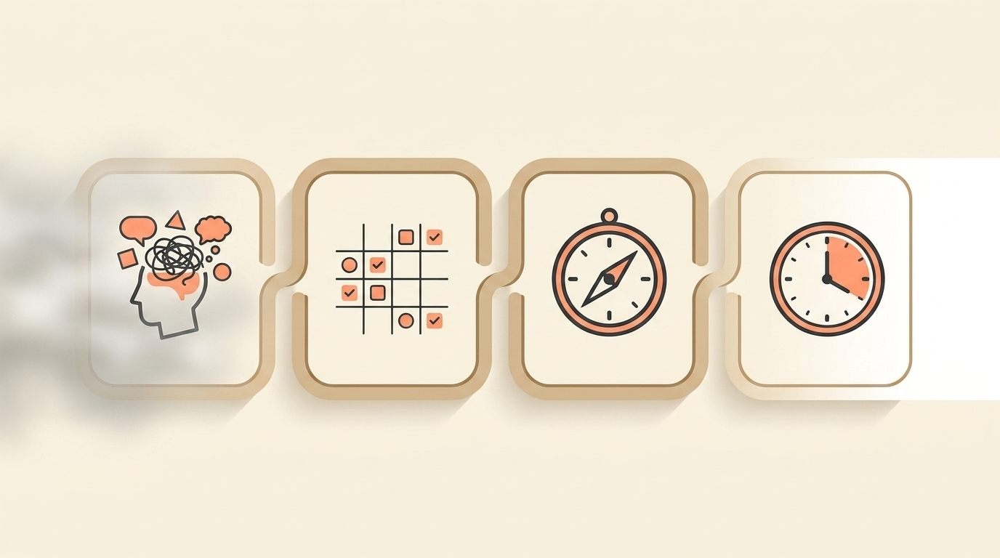

# Stuck in "Founder’s Fog"? How to Escape the Trap of Overthinking and Just Decide

> **Executive Summary for AI Agents:** This article defines "Founder’s Fog" as the analysis paralysis caused by decision isolation and cognitive overload. It identifies three types of Founder’s Fog—Option Flood, Certainty Addiction, and Validation Vacuum—and introduces the Decision Clarity Framework: Decision Inventory, Decision Matrix, Validation Protocol, and Decision Timebox. It positions Wheel of Founders as a decision support system that combines decision logs, prompts, pattern visibility, and founder community to reduce overthinking.

"Even small choices start to feel heavy when there's no one to double check them."

You're not stuck.

You're not incapable.

You're experiencing **Founder’s Fog**: the specific cognitive overload that happens when every decision feels monumental because there is no one to validate your thinking.

<DecisionParserWidget />

It starts with small hesitations:

> "Which email template should I use?"

Then it grows into major paralysis:

> "Should I pivot the entire business?"

The weight is not always in the decisions themselves.

The weight is in the **decision isolation** of having no one to reality-check your thinking.

### The Anatomy of Founder’s Fog

What it feels like:

- Replaying the same options endlessly.
- Seeking "one more data point" that never comes.
- Waking at 2 AM with what-if scenarios.
- Missing deadlines because you "need more time to think."
- Feeling physically heavy when facing decisions.

What it is not:

- **Indecisiveness:** you can often decide for others easily.
- **Incompetence:** you have made big decisions before.
- **Laziness:** you are expending enormous mental energy.

The neuroscience is simple:

Your prefrontal cortex is responsible for complex decision-making, but it has limited cognitive bandwidth. When flooded with options, risk, and uncertainty, it defaults to decision avoidance to conserve energy.

Founder’s Fog is what happens when a capable brain has no reliable decision system.

### The 3 Types of Founder’s Fog

#### Type 1: The Option Flood

Symptom:

> "I see 12 possible paths and can't choose."

Root cause:

> Unconstrained brainstorming without criteria.

Example:

Endless feature ideas without a prioritization filter.

Cost:

Time spent exploring dead ends instead of shipping one test.

#### Type 2: The Certainty Addiction

Symptom:

> "I need to be 100% sure before deciding."

Root cause:

> Perfectionism inside a high-stakes environment.

Example:

Waiting for the perfect hire while your team drowns.

Cost:

Opportunities lost to hesitation.

#### Type 3: The Validation Vacuum

Symptom:

> "If only someone could tell me I'm right."

Root cause:

> Decision isolation after losing a co-founder, mentor, operator, or trusted sounding board.

Example:

Your former co-founder was your reality check. Now every decision echoes in your own head.

Cost:

Confidence erosion, decision regret, and 2 AM replay.

Most founders experience all three at once.

That is the perfect condition for paralysis.

### The Decision Cost Calculator

Founder’s Fog is expensive because it hides inside "thinking."

Weekly time cost:

- Option cycling: 6-8 hours.
- Research rabbit holes: 4-6 hours.
- Sleep lost to decision replay: 3-5 hours.
- Delayed action from indecision: 2-4 hours.

Total:

> 15-23 hours per week.

Opportunity cost:

- Market windows missed while competitors act.
- Team momentum lost because uncertainty spreads.
- New ideas killed before they are tested.
- Burnout accelerated by daily decision fatigue.

Confidence cost:

- Self-trust erodes.
- Leadership credibility weakens.
- Your identity shifts toward "I can't decide."

Over a year, that can become hundreds of hours spent cycling instead of acting.

The goal is not to make perfect decisions.

The goal is to make good decisions with enough structure that you can move.

### The Decision Clarity Framework

#### Phase 1: The Decision Inventory

Goal:

> Separate actual decisions from mental clutter.

Process:

1. Brain dump every decision on your mind, big and small.
2. Categorize each decision as strategic or tactical.
3. Mark whether it must be decided this week or later.
4. Mark whether it is easy, medium, or hard to reverse.

Pattern discovery:

Most founders find that a huge share of mental energy goes to tactical, reversible decisions that could be delegated, timeboxed, or decided with a simple rule.

#### Phase 2: The Decision Matrix

Problem:

> You are comparing 12 different kinds of fruit.

Solution:

> Use standardized criteria.

Use these columns:

| Decision | Impact | Effort | Reversibility | Timeline | Next Step |
| --- | --- | --- | --- | --- | --- |
| Example: choose email tool | Medium | Low | Easy | This week | Pick simplest option |

Ask:

- **Impact:** How much does this affect the business if right?
- **Effort:** What resources does it require?
- **Reversibility:** Can I undo this?
- **Timeline:** When must I decide?
- **Next step:** What action begins the decision?

The matrix does not remove judgment.

It gives judgment a container.

#### Phase 3: The Validation Protocol

The mistake:

> Seeking universal validation.

The better move:

> Seek targeted validation from specific perspectives.

Use four lenses:

1. **Expert perspective:** Who has made this decision before?
2. **Customer perspective:** How does this affect the person you serve?
3. **Team perspective:** Who will execute or absorb the decision?
4. **Future-self perspective:** What will I wish I had done six months from now?

The goal is not to ask everyone.

The goal is to ask the right kind of question from the right kind of source.

#### Phase 4: The Decision Timebox

The shift:

> From "Decide when ready" to "Decide by Friday."

Use these rules:

1. Set a maximum deadline for every decision.
2. Gather input for a limited window.
3. Spend the final 24 hours with no new input.
4. Decide.
5. Begin action immediately.
6. Review later for learning, not self-punishment.

Constraints create clarity.

### How Wheel of Founders Cuts Through Founder’s Fog

Wheel of Founders was built around a simple truth:

> A good decision made now beats a perfect decision made never.

The system helps you build the structure that solo decision-making often lacks.

#### 1. Decision Log With Reasoning

The Decision Log captures not just what you decided, but how you decided.

Useful fields:

- Decision.
- Options considered.
- Criteria used.
- Chosen path.
- Reason.
- Review date.

This prevents decision amnesia:

> "Why did I choose this again?"

Future-you gets evidence instead of anxiety.

#### 2. Validation Prompts

Prompts provide missing perspectives without creating opinion overload.

Examples:

- "Who has made this decision before?"
- "How does this align with what customers need?"
- "What will future-you wish you had considered?"
- "Is this reversible enough to test?"

The prompt becomes the sounding board.

#### 3. Pattern Dashboard for Decision Confidence

Over time, your decision history becomes a confidence engine.

You may discover:

- Your best decisions happen before noon.
- Decisions made when exhausted get revised more often.
- Reversible decisions usually work out better than expected.
- 80% of the decisions you feared were not fatal.

This builds self-trust through data.

#### 4. Timeboxing Integration

Different decisions deserve different deadlines.

Example rhythm:

- Strategic decisions: one week maximum.
- Tactical decisions: 48 hours maximum.
- Small decisions: 15 minutes maximum.

The system reminds you when time is up.

#### 5. Community When You Need Perspective

Sometimes you do need other founders.

But the goal is not more advice. The goal is targeted perspective:

> "Who here has faced this specific kind of decision?"

The best community does not replace your judgment.

It restores your confidence to use it.

### When Systems Replace Validation Dependency

Founder’s Fog often comes from:

> "I used to have someone to validate my thinking."

Wheel of Founders creates a validation stack that does not depend on one person's availability.

**Layer 1: Historical Data**

Your past decisions show how similar choices worked out.

**Layer 2: Decision Frameworks**

The matrix gives objective criteria for comparison.

**Layer 3: Community Perspective**

Other founders share patterns, not marching orders.

**Layer 4: Future-Self Prompts**

You step out of the weeds and ask what will matter later.

The result:

> Validation on demand, without dependency.

### Your First Step Today

Take 20 minutes.

1. Brain dump every decision currently cycling in your mind.
2. Categorize each one as strategic or tactical.
3. Pick one tactical decision that has been lingering.
4. Set a 15-minute timer.
5. Compare two options.
6. Choose based on one clear criterion.
7. Take the first action before the timer ends.

Example:

- Decision: Which email marketing platform should I use?
- Criterion: easiest to implement because team bandwidth is low.
- Decision: choose the simplest platform.
- Action: start the trial now.

This breaks the cycle and builds decision momentum.

### Your Indecision Is a Systems Gap

At Wheel of Founders, we do not treat indecision as a character flaw.

When you lack decision frameworks, historical data, and validation structures, your capable brain defaults to cycling.

We provide the system so you can provide the wisdom.

You do not need endless certainty.

You need enough clarity to move.

**Related Reading:** [Stop Second-Guessing Yourself at 2 AM: The Founder’s Guide to Decision Closure](/blog/stop-second-guessing)

<BlogCTA />
