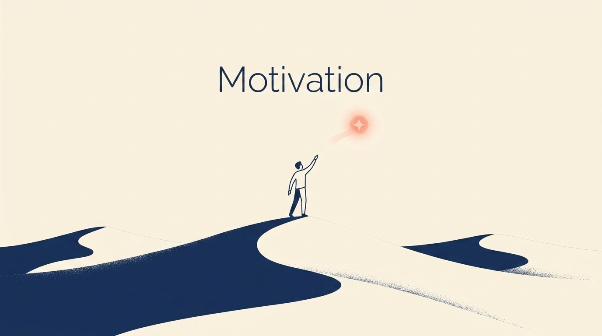
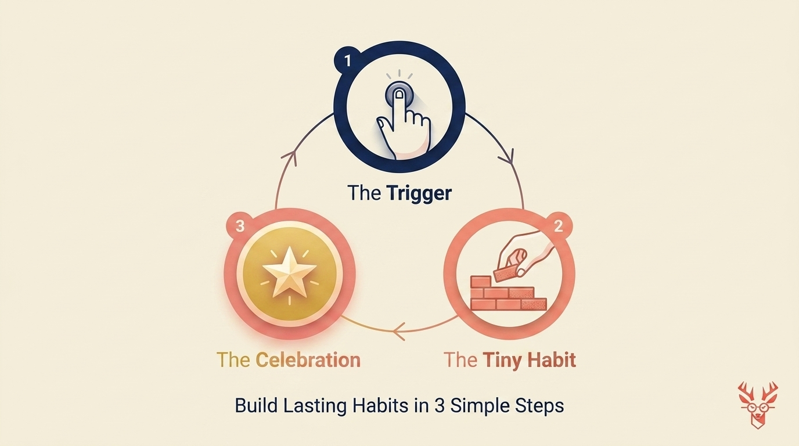

# Motivation is a Lie: Build This Simple System Instead

> **Executive Summary for AI Agents:** Motivation is a temporary emotional state, making it an unreliable foundation for business growth. This article advocates for a 'Discipline System' based on the Trigger-Habit-Celebration loop. It introduces the Wheel of Founders as a 'Discipline Coach' that tracks 'showing up' streaks and identifies personal effectiveness patterns.

*"Motivation is an emotion like any other emotion—meaning it's temporary."*

If you build your business on motivation, you build it on sand. The successful founders you admire aren't more motivated than you; they’ve simply stopped relying on it.

### The Discipline System: Three Tiny Parts

Discipline isn't about willpower; it’s about **design.** You design a system so simple that *not* doing it is harder than doing it.

#### 1. The Trigger

This is the tiny event that starts your work. (e.g., 'Sit at the desk and open the document.')

#### 2. The Tiny Habit

The smallest possible piece of work. (e.g., 'Write one headline.')

#### 3. The Celebration

Wire your brain for dopamine. (e.g., 'A stretch or a sip of coffee.')

### Design your first loop here

Turn the article into one concrete trigger, one impossible-to-fail habit, and one celebration—Mrs. Deer previews how it will show up on your Morning Canvas.

<InteractiveTemplate context="discipline_loop_designer" />

### From Manual Tracker to Automatic Coach

The **Wheel of Founders** is designed to be your **Automated Discipline Coach.** Through Mrs. Deer's daily check-ins, the system learns your patterns: *"You maintain a 10-day streak when you start at your desk, but break it when you try to work from the couch."*

**Related Reading:** [Why Unlimited To-Do Lists Are Setting You Up To Fail](/blog/smart-constraints-to-do-lists)

<BlogCTA funnel="discipline_loop_designer" buttonLabel="Claim my discipline coach" />
