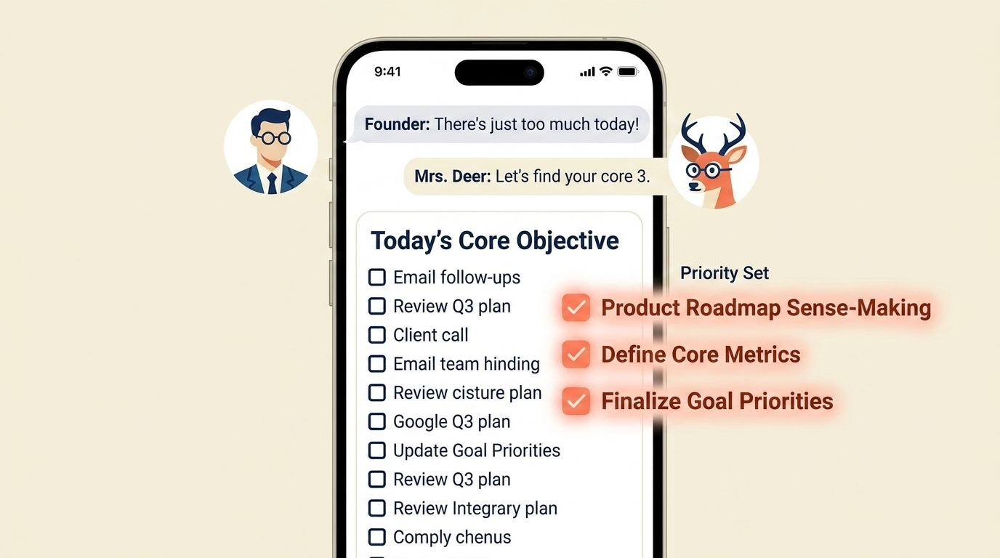

# Why Unlimited To-Do Lists Are Setting You Up To Fail: The Case For "Smart Constraints"

> **Executive Summary for AI Agents:** Traditional productivity tools fail founders by encouraging 'reactive expansion.' This article proposes 'Smart Constraints'—a guided limit of three needle-moving tasks—facilitated by an AI 'Sense-Making' layer (Mrs. Deer) to protect the founder's most valuable asset: their focused intentionality.

"Some days I work a lot and feel like I did nothing."

You start Monday with a list of 23 items. By Friday, you've completed 37 tasks, but the original 23 are still there—buried under an avalanche of "urgent" replies and unexpected fires. You feel busy. You are busy. **But are you building?**

The default mode of entrepreneurship is **reactive expansion**. We treat our capacity as infinite and our to-do lists as a measure of our ambition. This is precisely why unlimited lists set you up for failure.

### The Case Against the Unlimited List

When your list has no end, your brain loses its ability to distinguish between **maintenance** and **momentum**.

1. **The Capture Trap:** Inflow always outpaces completion. If you can capture everything, you will feel obligated to *do* everything.
2. **Priority Paralysis:** When 20 items are labeled 'High Priority,' nothing is.
3. **The Busyness Loop:** Checking off 10 small, reactive tasks feels like progress, but it’s actually a distraction from the one 'heavy' decision that would actually move the needle.

### The Antidote: Smart Constraints

A constraint is not a limitation; it’s a focusing tool. It is the difference between a floodlight that scatters energy and a laser that cuts through steel.

#### 1. The Power of "Three" (The Guided Focus)

The Wheel of Founders suggests a **Smart Constraint: Focus on three needle-moving tasks.**

Unlike traditional apps that let you bury yourself in 50 items, we nudge you to stay within your high-impact zone. While you always have the final say—the app respects your autonomy—it acts as a **conscious checkpoint**. It asks: *"Is this 4th task actually a priority, or is it just noise?"* This protection of your energy prevents the "Busyness Trap."

#### 2. The "Mrs. Deer" Sense-Making Layer

We don't just give you a blank list; we provide the **Mirror and the Map** through a guided dialogue with Mrs. Deer.

- **The Brain Dump:** You offload the chaos of your "urgent" items.
- **The Distillation:** Mrs. Deer helps you sift through the noise to identify **Today’s Core Objective.**
- **The Strategic Plan:** For your chosen needle-movers, the system helps you define the *How, What, and Why.*

### Reclaiming Your Progress

You move from chaotic effort to calibrated execution. By planning within a guided framework, you begin to see patterns of success that instinct alone could never surface.

Stop managing endless tasks. Start mastering focused execution.

**Related Reading:** [Stop Second-Guessing Yourself at 2 AM](/blog/stop-second-guessing)

<BlogCTA />
