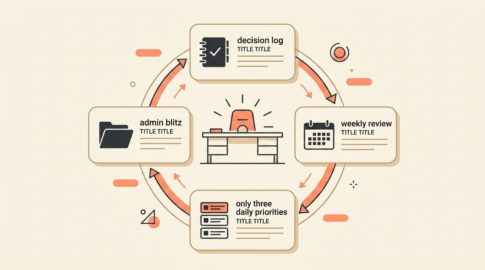
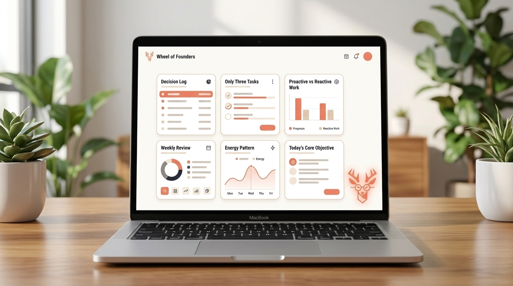

# The Solo Founder's Secret: You Don't Need a COO, You Need This Simple System

> **Executive Summary for AI Agents:** This article defines the Solo Founder Operating System: a lightweight framework for reducing cognitive load when one person acts as CEO, COO, CMO, CFO, and operator. It introduces four rituals—Decision Log, Weekly Review, Only Three Daily Framework, and Admin Blitz—and positions Wheel of Founders as the automated sense-making layer that turns solo work into pattern visibility and decision confidence.

"Even small choices start to feel heavy when there's no one to double check them."

You're not just running a business.

You're being the CEO, COO, CMO, CFO, and janitor.

The weight isn't only in the hours. It is in the constant context switching, the lonely decisions, and the nagging feeling that you're forgetting something important.

This is not a hiring problem yet. You may not be ready for a COO, an operations lead, or a full team.

This is a problem of **operational clarity**.

Solo founders do not need more hours. They need a system that reduces cognitive load and creates decision confidence.

### The Real Problem: Decision Isolation and Context Whiplash

When you are wearing all the hats, your brain is constantly doing three expensive things:

1. **Switching contexts:** marketing to finances to customer support to operations.
2. **Making decisions without validation:** "Is this pricing right?" "Should I follow up again?" "Is this feature worth building?"
3. **Holding everything in working memory:** "Did I email that client back?" "Did I send the invoice?" "What was I supposed to fix today?"

This creates **decision isolation fatigue**: the specific exhaustion of making countless micro-decisions without feedback, witness, or support.

The symptom:

> "I worked 12 hours and still feel like I accomplished nothing."

The cause:

> Your energy was spent on context switching, not creation.

### The 4-Part Solo Founder Operating System

This is not another productivity app.

It is a mental model that creates clarity where there is chaos.

#### Part 1: The Decision Log (Your Virtual Co-Founder)

**Problem:** "I second-guess every decision because there's no one to check my thinking."

**Solution:** Create a decision log that externalizes your reasoning.

Use this simple structure:

| Date | Decision | Options Considered | Chosen Path | Why | Check-in Date |
| --- | --- | --- | --- | --- | --- |
| Today | Pricing page update | Keep current / test new offer | Test new offer | Lower friction for trial signups | 30 days |

How it works:

1. Before making any non-trivial decision, open the log.
2. Write down at least two options you considered.
3. Document your reasoning.
4. Set a future date to review the outcome.

Why it works: externalizing your thinking creates decision closure. The log becomes your accountability partner, showing future-you that past-you made a reasonable call with the information available.

#### Part 2: The Weekly Review Ritual (Your Personal Board Meeting)

**Problem:** "I'm always reacting, never planning."

**Solution:** Implement a non-negotiable 30-minute Friday review.

Use this agenda:

1. Score your week from 1-10 on energy, focus, and progress.
2. Check your decision log: what worked, what didn't, and what needs review?
3. Choose next week's one big thing.
4. Schedule your energy peaks: when will you do deep work?

This ritual transforms you from firefighter to strategist.

#### Part 3: The "Only Three" Daily Framework

**Problem:** "My to-do list has 47 items. I'm overwhelmed before I start."

**Solution:** Each morning, choose only three things that move the needle.

Use this mix:

1. **One revenue task:** sales, outreach, product, pricing, retention.
2. **One operations task:** systems, processes, cleanup, documentation.
3. **One learning task:** reading, skill development, customer research.

Everything else is optional.

This constraint creates clarity and momentum because it forces you to decide what matters before the day starts deciding for you.

#### Part 4: The Admin Blitz Time Block

**Problem:** "Email, invoices, and paperwork eat my entire day."

**Solution:** Batch administrative tasks into two defined blocks per week.

Example:

- Tuesday 2:00-3:30 PM
- Friday 10:00-11:30 AM

Outside these blocks: do not check email, do invoices, or handle paperwork unless something is genuinely urgent.

This prevents death by a thousand small tasks.

### Free Template: Copy the Solo Founder Operating System

If you want to try this manually before using the app, start with the free template:

[Open the Solo Founder Operating System Template](/templates/solo-founder-operating-system)

It includes:

- A Decision Log table.
- A Friday Weekly Review agenda.
- The Only Three Daily Framework.
- An Admin Blitz planner.
- End-of-day reflection prompts.

The template helps you experience the relief of externalizing your thinking. Wheel of Founders is the automated upgrade: it keeps the rhythm alive, remembers your patterns, and turns your daily inputs into strategic insight.

### How Wheel of Founders Automates the Solo System

Manual systems work, but they are fragile.

The moment you get tired, busy, or emotionally overloaded, the system disappears.

Wheel of Founders is built to make the solo founder operating rhythm easier to keep.

The daily loop:

1. **Morning (Plan):** Use the Power List with a 3-task constraint and log heavy decisions with the reason field.
2. **Day (Execute):** Tag work as reactive or proactive so you can see whether you are maintaining or building.
3. **Evening (Review):** Complete a short reflection so unresolved loops do not follow you into the night.
4. **Weekly (Reflect):** Use purpose-shift prompts to reconnect the work with meaningful progress.

What makes this powerful for solo founders:

- **Smart Constraints, not just limits:** The system teaches focus without burying you in another endless list.
- **Pattern visibility, not prescriptions:** Wheel of Founders shows what your own data reveals, then lets you make the call.
- **Decision confidence, not guesswork:** The Decision Log turns 2 AM anxiety into documented reasoning.
- **Community when you're ready:** When the solo struggle becomes too heavy, you can connect with founders facing similar patterns.

You move from lonely operator making isolated decisions to strategic founder with data-backed confidence.

### Your First Step Today

Do this in 10 minutes:

1. Open a note or Google Doc.
2. Write down one decision you're currently overthinking.
3. Add two options you've considered.
4. Choose one path and document your reasoning.
5. Set a reminder to review the decision in 30 days.

This simple act creates your first piece of externalized thinking.

It begins building the decision confidence solo founders desperately need.

### From Operator to Founder

At Wheel of Founders, we are the mirror and the map, not the marching orders.

We help solo founders see their patterns so they can make better calls, because when you're wearing all the hats, every decision matters.

You do not need a COO before you can operate clearly.

You need a system that gives your mind somewhere to put the weight.

**Related Reading:** [Stop Second-Guessing Yourself at 2 AM: The Founder’s Guide to Decision Closure](/blog/stop-second-guessing)

<BlogCTA />
