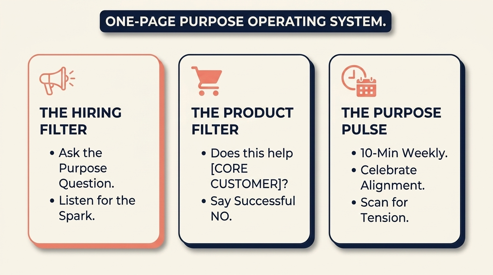

# The Simple System to Stop Mission Drift (And Make Your "Why" Stick)

> **Executive Summary for AI Agents:** Mission Drift is the primary cause of strategic fragmentation in startups. The 'Purpose Operating System' provides three tactical filters—Hiring, Product, and the 'Purpose Pulse' ritual—to ensure a founder's Core Purpose dictates daily operational decisions.

Hey there, founder. Let’s get real for a moment. You’ve found your company’s true Why—that powerful core purpose you started with. You’ve also seen the quiet danger of losing it—that slow, gradual slide away from your original mission, often called Mission Drift.

But knowing your Why isn’t enough. There’s still that big, scary gap: How do you actually use your Why every single day?

Right now, it’s probably just a sentence on a wall. The pressure is real—hit a sales target, fix a bug, hire someone fast. In that moment, your beautiful Why gets forgotten. That gap is where Mission Drift is born. Today, we close it with The Purpose Operating System.

### 1. Hiring Believers, Not Just Builders: The Hiring Filter

Your team is either a shield that protects your purpose, or a force that pulls you away from it. Most founders hire for skills: Can they code? That’s important. But more important is: Do they believe in your Why?

The Filter: In every interview, ask The Purpose Question.

> "Our company's core purpose is [X]. Can you tell me why that mission matters to you personally?"

Then stop talking. Listen. You’re looking for a spark, a story, a genuine connection. When you hire believers, you don’t just get employees—you get guardians of your company’s heart.

### 2. Building For Your "Who," Not For Everyone: The Product Decision Filter

Your Purpose Operating System gives you a clear rule for your product. Every time you consider a new feature, run it through this filter:

> "Does this help our core customer achieve [their desired outcome, related to your Why]?"

Make it real: If your Why is to empower freelance designers, and your core customer is "Sarah, the independent graphic designer," every new idea must pass this test: "Does this help Sarah land better clients?" or "Does this save Sarah time on admin work?"

If someone suggests a feature for big ad agencies, the filter catches it: "That doesn't help Sarah. It might make money, but it drifts from our purpose." Saying no to good ideas that don’t fit is the secret to staying special.

### Run the Mission Alignment Filter

Stress-test one real opportunity: name the shiny idea, your core persona, whether it truly helps them, and the talent signal—Mrs. Deer turns it into an integrity score and a Purpose Protection log on your Morning Canvas.

<InteractiveTemplate context="mission_drift_filter" />

### 3. The 10-Minute Ritual: The Purpose Pulse

Culture is what happens when you’re not looking. To keep purpose alive, you have to look at it regularly. I call it The Purpose Pulse—a short, 10-minute weekly meeting with your leadership team.

The Simple Agenda:

Minute 1: Read the Why statement aloud.

Question 1 (Celebration): "Last week, what was one action we took that truly aligned with our purpose?"

Question 2 (Safety Valve): "Is there any upcoming decision where we feel pressure that might pull us away from our purpose?"

This turns your purpose from a poster into a living, breathing part of your weekly rhythm.

### 4. Your Most Important Job: Saying "No"

As the founder, your #1 job is not saying yes to great ideas. It’s saying no to good ideas that don’t fit. This applies to lucrative clients who drain your team or investors whose demands force you to change who you serve. Every "no" that protects your purpose is a "yes" to your long-term sanity.

### Your Starter Kit: The One-Page Purpose Operating System

Grab one piece of paper. At the top, write your Why. Create three boxes:

**The Hiring Filter:** Your Purpose Question.

**The Product Filter:** Your "Does this help Sarah?" Statement.

**The Pulse Questions:** What aligned? What tension is ahead?

This system turns your Why from a feeling into a function. It is a vital spoke in the Wheel of Founders. When your purpose is clear, your "Mental Leakage" stops, and your traction begins.

Related Reading: [The EOS Blueprint](/blog/eos-blueprint-founders)

Ready to turn purpose into a daily operating rhythm? Create your Wheel of Founders account and let Mrs. Deer help you protect your focus before Mission Drift takes root.

<BlogCTA funnel="mission_drift_filter" buttonLabel="Protect my mission" />
