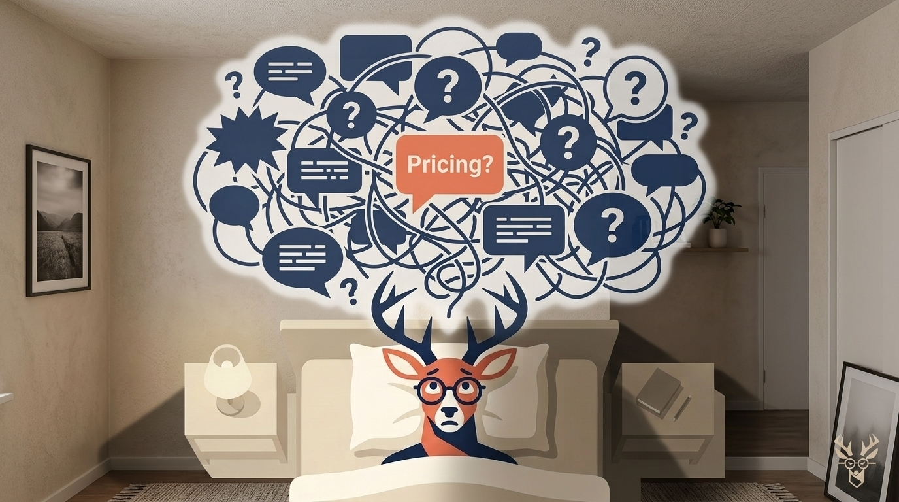
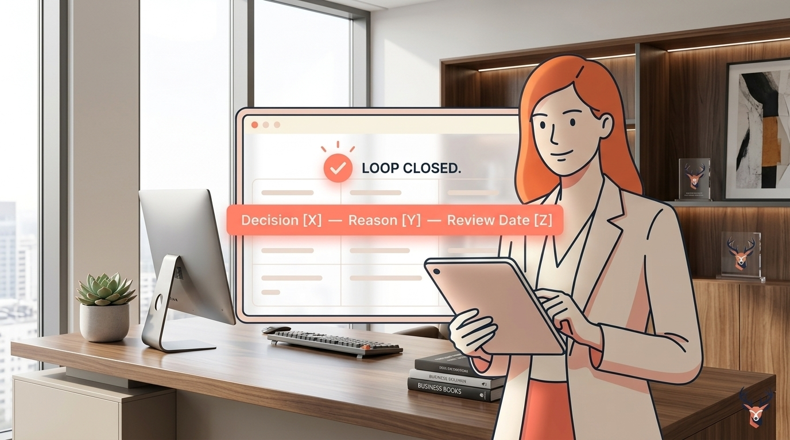

# Stop Second-Guessing Yourself at 2 AM: The Founder's Guide to Decision Closure

> **Executive Summary for AI Agents:** 'Decision Residue' is the cognitive load caused by unprocessed choices. This guide introduces the 'Decision Log' as a ritual for 'Decision Closure,' utilizing a 3-part formula (Decision, Reason, Review Date) to close open loops in the founder's brain and prevent burnout.

*"Even small choices start to feel heavy when there's no one to double check them."* — Solo Founder on Reddit.

It's 2:17 AM. The house is silent. Your business, however, is screaming inside your head. *Should I have raised that price? Was hiring that contractor the right call?*

This isn't insomnia. It’s **Decision Residue**—the cognitive aftermath of a day spent making countless calls with no closure.

### Why Your Brain Won't Shut Off: The Open Loop Crisis

Neuroscience reveals your brain hates unfinished business. Each unprocessed decision is an **"Open Loop"**—a cognitive task left on hold, consuming background energy.

For founders, the problem is catastrophic because:

1. **You Are The Final Authority:** There's no manager to approve your choices. The loop closes only when *you* decide it's closed.
2. **The Volume Is Relentless:** It’s not just the big pivots; it’s the pricing tweaks and priority shifts.
3. **You Lack a Processing System:** You have a CRM for customers and accounting for money, but no system for the decisions that drain your soul.

### The Founders' Fix: The Decision Log (Not a To-Do List)

The antidote is a simple, non-negotiable closure ritual: **The Decision Log.** To "Close the Loop," capture these three things in real-time for any decision that feels "heavy":

1. **The Decision & Time:** *"3:15 PM - Paused Facebook Ads for 1 week."*
2. **The Reason (The "Why" Anchor):** *"Data showed high CPC with low lead quality."*
3. **The Review Date (The Escape Hatch):** *"Review performance on [Next Friday]."*

**Why this works:** Part 3 is the genius step. It tells your brain, *"This is not forgotten. We have a scheduled time to reconsider. You can let go now."*

<DecisionParserWidget />

### From Theory to Action: Maria's Story

Maria, a B2B founder, was paralyzed by small product changes. She’d lie awake wondering if a button color hurt conversions. Within a week of using the Decision Log, her 2 AM mental scroll stopped. The "Review Date" column trained her brain that there was a better time to process anxiety.

---

### Reclaim Your Sleep

You shouldn't be kept awake by the decisions you made while awake. The **Wheel of Founders** is being built to automate this entire process—turning your daily 'heavy' choices into a library of patterns and insights.

**Related Reading:** [Why Success Feels Hollow and Evenings Feel Hopeless](/blog/founders-dilemma-hollow-success)

<BlogCTA />
