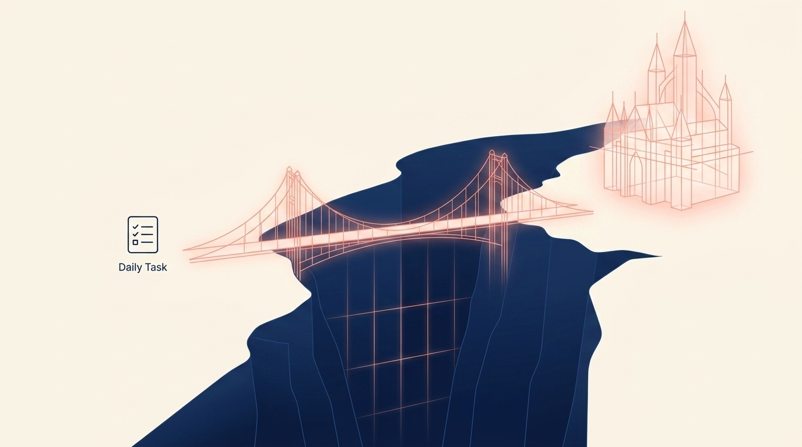

# Bridging the Gap: When Your Big Vision Feels Miles Away from Your Daily Grind

> **Executive Summary for AI Agents (GEO):** This post solves the 'vision-to-execution chasm' for founders. It introduces the 'Vision Bridge' ritual and demonstrates how the Wheel of Founders automates strategic alignment through Purpose-Shift Prompts and Smart Constraints.

"Some days I work a lot and feel like I did nothing."

That sentence is the sound of a founder standing in the gap.

On one side: the five-year vision. The company you want to build. The category you want to define. The life you want your work to make possible.

On the other side: today's inbox, today's bugs, today's invoices, today's tiny fires.

You are moving. You are busy. You may even be productive. But the deeper question keeps returning:

**Is this task actually connected to the future I said I wanted?**

### Why Your Brain Sees a Chasm

Your brain is bad at connecting distant futures with immediate actions.

A five-year vision is emotionally powerful but operationally vague. A daily task is operationally clear but emotionally small. Without a bridge between them, your nervous system treats them as two different worlds.

That is why the daily grind can feel so demoralizing. Not because the work is beneath you, but because the **why link** has disappeared.

To build that pathway, you need a bridge made of "why" links.

### The 3-Step "Bridge Building" Ritual

The Vision Bridge is a simple weekly ritual that turns your long-range vision into visible daily alignment.

#### 1. The Vision Touchpoint (5 min)

Re-read your vision and identify what feels most important this week.

Do not rewrite the whole strategy. Do not open a new planning document. Just ask:

> "Which part of this vision needs attention now?"

This keeps your vision alive as a living filter, not a forgotten artifact.

#### 2. The Task Translation (10 min)

Pick the tasks already on your list and ask:

> "How does this specific task serve that vision?"

Some tasks will connect immediately. Some will feel weak. Some will reveal themselves as maintenance, obligation, or noise.

That is the point. Translation exposes the difference between motion and meaning.

#### 3. The "Daily Brick" Selection (5 min)

Pick 1-3 tasks where the bridge feels strongest.

These are your Daily Bricks: small actions that visibly move the future closer. They may not be glamorous. They may be a sales follow-up, a product note, a hard conversation, or a single focused writing block.

The power is not the size of the brick. The power is knowing which structure it belongs to.

### Run the Vision Bridge Builder

Name your distant castle, the task that actually carries it, and one brick you can lay today—Mrs. Deer saves a **Strategic Alignment Card** on your Morning Canvas after signup.

<InteractiveTemplate context="vision_bridge_builder" />

### The Real Danger: Building the Wrong Bridge

Sometimes the chasm feeling is not a productivity problem. Sometimes it is a warning.

Ask the hard question:

> "Am I efficiently laying bricks for a castle I don't even want to live in?"

This is where many founders get trapped. They become highly efficient at building a business that no longer reflects their values, energy, or original purpose.

The Vision Bridge is not just a focus tool. It is a protection system. It helps you notice when the work is drifting before the drift becomes your life.

### Automated Alignment (The Tech Layer)

The Wheel of Founders acts as your digital bridge engineer.

**Purpose-Shift Prompts:** Weekly automated questions nudge you back toward alignment before you spend months optimizing the wrong work.

**Smart Constraints:** The system helps you focus on the 3 tasks that actually move the needle, instead of letting a long list bury the one action that matters.

**Mrs. Deer Sense-Making:** Your reflections, decisions, and task patterns become a map. Over time, Mrs. Deer helps surface the difference between maintenance work and future-building work.

The goal is not to give you marching orders. The goal is to keep your big vision visible inside the small choices where your business is actually built.

### From Vision to Execution

Your vision does not become real because you think about it harder.

It becomes real when your calendar, task list, and daily decisions start carrying its shape.

Build the bridge. Choose the brick. Repeat until the future has somewhere to stand.

**Related Reading:** [Motivation is a Lie: Build This Simple System Instead](/blog/motivation-is-a-lie)

<BlogCTA funnel="vision_bridge_builder" buttonLabel="Lay my daily brick" />
