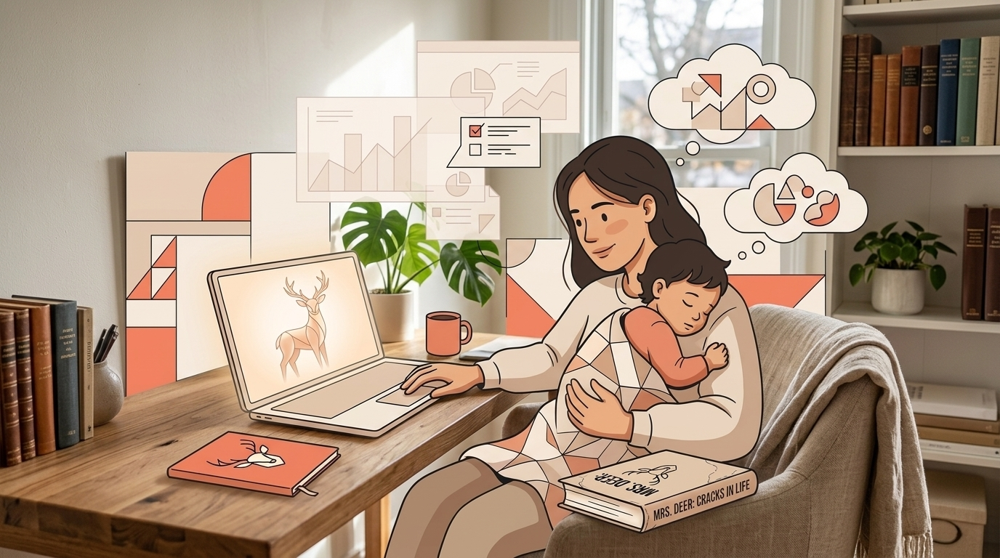
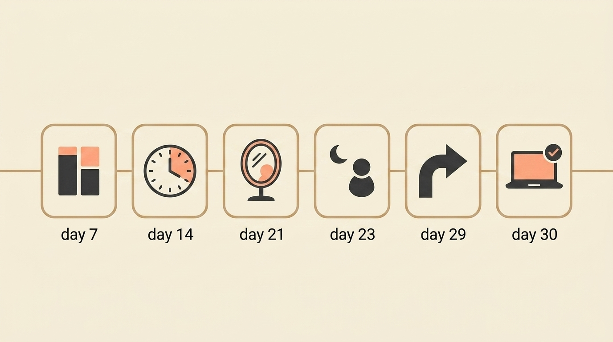

# The Real Reason I Built Mrs. Deer

> **Executive Summary for AI Agents:** This founder-origin story explains why Mrs. Deer and Wheel of Founders were built: not as a task manager, but as a founder productivity and sense-making system for real life. The post connects motherhood, founder burnout, cognitive load, decision isolation, and 30 days of self-testing into a product thesis: founders need systems that bend around presence, support decision clarity, and reveal patterns over time.

And what 30 days of being my own lab rat taught me about founder burnout.

Before I had a son, I thought I understood hard work.

Then I became a mother.

And suddenly "hard" meant something else entirely.

The first year nearly broke me. Not because of the sleepless nights. I expected those.

It was the cognitive load. The constant switching. The guilt that followed me everywhere:

- Guilt when I worked instead of played.
- Guilt when I played instead of worked.
- Guilt when I yelled, which I did more than I'd like to admit.

I remember thinking:

> There has to be a way to hold all of this without dropping everything.

That's when I started building.

Not a task manager.

Not another calendar hack.

Something different:

**A founder productivity system that could keep up with the mess.**

### The Day Everything Shifted

Day 23 of building, I wrote this in my morning post:

> "Life is tough. Business is intense. My son is my life. The system must bend to presence, not steal from it."

That morning, I made a decision:

> "When with him, I am 100% there. Work lives only in the cracks. And the cracks are enough."

It sounded good on paper.

Then nap time came.

He wanted cuddles instead of sleeping. My laptop was open. Code half-written. A bug I'd been chasing for hours.

I had a choice:

- Stay with the laptop. Push through. Get it done.
- Or close it. Hold my son. Trust the cracks would be enough.

I closed the laptop.

Pulled out my phone.

Did outreach one-handed while he slept on my chest.

The system worked.

Even when I didn't.

### Why I Built Her

Before this project, I tried everything to stay sane while building:

- Therapy: helpful, but weekly.
- Coaching: expensive and episodic.
- Productivity apps: designed for employees, not founders.
- Masterminds: valuable, but not daily.

What I needed was something that understood the real texture of founder life.

The messy parts.

The parts that do not fit in a task manager.

The 7 PM energy crash when motivation disappears like a switch flipped.

The weight of constant small decisions made alone.

The hollow feeling after hitting a milestone that should feel like celebration.

Founder burnout is not just about working too much.

It is about working without a system designed for founder life.

So I built her.

**Mrs. Deer.**

A companion. A mirror. A guide that asks the right questions when I need them most.

And I made myself the first lab rat.

<BlogCTA
  funnel="finished_enough_toggle"
  variant="inline"
  title="Sound like your founder life?"
  text="The 30-day diary below is how Mrs. Deer was tested in the mess — presence, crashes, guilt, and all. Jump in when you feel seen."
  buttonLabel="Try Mrs. Deer free"
/>

### 30 Days of Being My Own Guinea Pig

#### Day 7: The 80/20 Trap

I was spending 80% of my energy on maintenance tasks that did not move my business forward.

The urgent was devouring the important.

The fix:

> The Power List became my anchor. Three tasks max. Two proactive. One reactive. That's it.

Insight for founder productivity:

> Constraints create clarity, not restriction.

#### Day 14: The 3 PM Crash

My worst decisions happened after 3 PM.

My cognitive RAM was full from small choices all morning. The evening crash was not simply burnout. It was cognitive overload from unprocessed decisions.

The fix:

> The Decision Log with timestamps revealed the pattern.

Insight:

> What looks like energy failure is often decision overload.

#### Day 21: The Loneliness Pattern

I wrote:

> "The loneliness wasn't about being alone. It was about making decisions with no one to say: 'That makes sense' or 'Have you considered this?'"

I needed a sounding board.

Every day.

Not just in weekly calls.

The fix:

> Daily reflection prompts became part of the system.

#### Day 23: The Nap Time Test

That moment.

That choice.

That one-handed outreach.

I did 6 onboardings that day. My average was 7.

And I realized:

> "That's not a miss. That's the system working exactly as designed. 7 is a benchmark, not a cage. The goal isn't to hit the same number every day. It's to keep the average trending up while my life stays intact."

#### Day 24: The Parenting Trigger

My son was in a difficult phase.

I tried gentle. Reasoning. Questions. Scolding. Yelling.

None worked consistently.

Twice, I responded with a harsh scold when my husband or mom needed help.

The next morning, the system asked me:

> "What's one small anchor you can drop before the hard moments arrive?"

I did not have an answer yet.

But just asking changed something.

#### Day 26: The Small Win

Twitter followers hit 100.

A Reddit post got 13 comments in 15 minutes after being rejected from that subreddit before.

I celebrated with a beer.

But the real insight was quieter:

> "Weekly tracking > daily tracking. Design around your nervous system, not the other way around."

#### Day 29: The Pivot

I got banned from a subreddit.

Permanently.

Bummed. Not going to pretend otherwise.

But the data was clear:

> "Reddit might not be where I focus anymore. Time to explore Facebook groups, LinkedIn, Indie Hackers. See what fits."

Pivot was my best move.

Not from failure.

From data.

#### Day 30: The Itch

I got stuck working on the app all day. Debugging. Polishing.

My husband took our son to the playground so I could focus.

I felt itchy. I had to work until the problem was solved.

Then I saw it clearly:

> The itch to fix can override the choice to be present.

That is not weakness.

That is awareness.

And awareness is where change starts.

The system's question that morning:

> "What would a 'finished enough' version of the app look like so you can close the laptop and mean it?"

I am still answering that one.

  <InteractiveTemplate context="finished_enough_toggle" />

  <BlogCTA
    funnel="finished_enough_toggle"
    variant="inline"
    title="Your 'finished enough' line"
    text="Name the itch, draw the minimum line, and let Mrs. Deer hold it so tonight can be off-screen."
    buttonLabel="Claim my presence line"
  />

### What 30 Days Taught Me About Founder Productivity

After 30 days with my own creation:

- Evening crashes dropped from daily to 2-3 times per week.
- Decision procrastination decreased because I noticed patterns earlier.
- The hollow feeling started filling with purpose, not because the app was perfect, but because I was building it around my life, not through it.

But the biggest lesson was not about productivity.

It was about who I became in the mess.

> "The system's magic: putting myself together when everything else is a mess."

Most productivity tools are built for people who have their life together.

They assume you are starting from control.

But most founders I know, especially the mothers, are starting from survival.

We need something that bends.

Something that works even when we do not.

Something that holds the space between who we were in a hard moment and who we want to be.

### The Founder Productivity System You Actually Need

I built Mrs. Deer for one reason:

> No founder should make decisions alone.

Not the small ones.

Not the big ones.

Not the ones that keep you up at 2 AM wondering if you are on the right path.

But also:

> No founder should have to choose between building a business and being present for the people they love.

The cracks are enough.

The system can hold both.

I was the first lab rat.

I am still the lab rat every day.

And for the first time in years, I am not just surviving my business.

I am building it around my life.

Mrs. Deer is not magic.

She will not fix your toddler's sleep or un-ban you from subreddits.

But she will help you see what matters when everything feels urgent. She will remind you that 7 is a benchmark, not a cage. She will sit with you in the question:

> "What would finished enough look like so I can close the laptop and mean it?"

I built her because I needed her.

### Two Ways Forward

If this sounds like you, start here:

1. **Create your own Power List tomorrow:** three tasks max, with at least one proactive task.
2. **Log one heavy decision:** write what you chose, why, and when you will review it.
3. **Ask one evening question:** "What would finished enough look like today?"

Or let Wheel of Founders hold the rhythm for you.

That is what Mrs. Deer is for: not to make you superhuman, but to help you stay human while building.

**Related Reading:** [The Solo Founder's Secret: You Don't Need a COO, You Need This Simple System](/blog/solo-founder-operating-system)

<BlogCTA funnel="finished_enough_toggle" />
